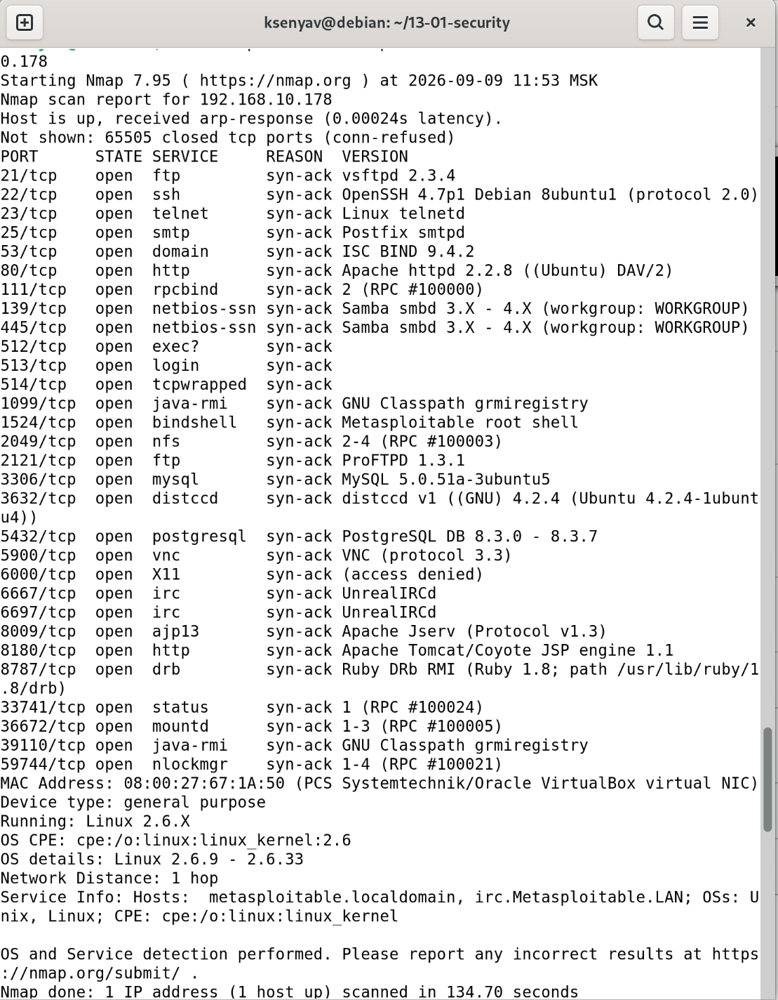
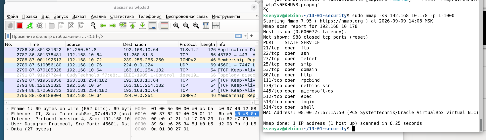
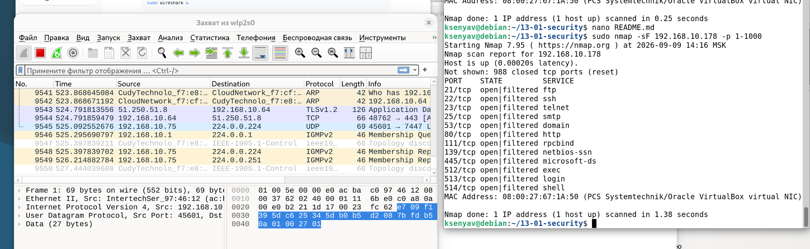
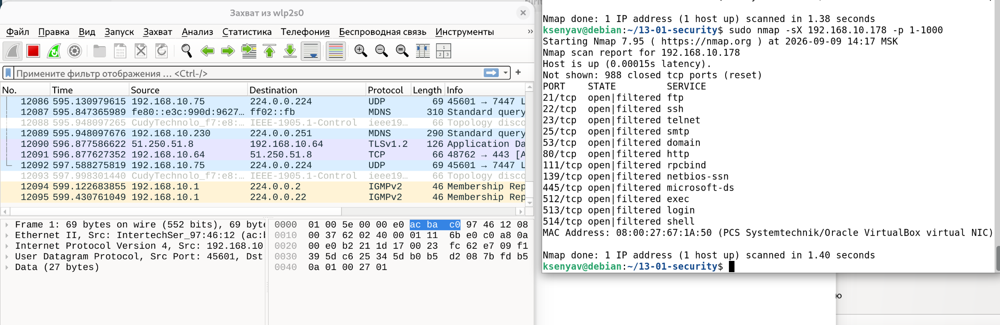
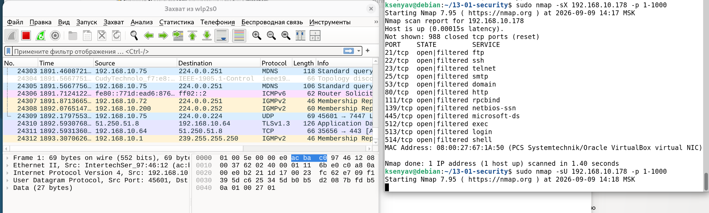

# Домашнее задание к занятию «Уязвимости и атаки на информационные системы»

**Выполнила:** Ксения Волчица

---

## Задание 1. Сканирование Metasploitable с помощью Nmap

### Описание

Была скачана и установлена виртуальная машина **Metasploitable 2**. Произведено сканирование открытых сетевых портов с помощью утилиты `nmap` в режиме TCP Connect (`-sT`) с определением версий служб и операционной системы.

---

### Команда сканирования

```bash
sudo nmap -sT -sV -O -p- --reason -Pn --min-rate 100 192.168.10.178
```

[Файл с результатом сканирования:](img/scan_result.txt)




- Какие сетевые службы в ней разрешены?

### Обнаруженные сетевые службы

| Порт | Служба | Версия |
|------|--------|--------|
| 21/tcp | FTP | vsftpd 2.3.4 |
| 22/tcp | SSH | OpenSSH 4.7p1 |
| 23/tcp | Telnet | Linux telnetd |
| 25/tcp | SMTP | Postfix smtpd |
| 53/tcp | DNS | ISC BIND 9.4.2 |
| 80/tcp | HTTP | Apache httpd 2.2.8 |
| 111/tcp | RPC | rpcbind |
| 139/tcp | NetBIOS | Samba smbd 3.X |
| 445/tcp | SMB | Samba smbd 3.X |
| 512/tcp | exec | rsh |
| 513/tcp | login | rlogin |
| 514/tcp | shell | rshd |
| 1099/tcp | RMI | GNU Classpath grmiregistry |
| 1524/tcp | bindshell | Metasploitable root shell |
| 2049/tcp | NFS | nfs |
| 2121/tcp | FTP | ProFTPD 1.3.1 |
| 3306/tcp | MySQL | MySQL 5.0.51a |
| 3632/tcp | distcc | distccd v1 |
| 5432/tcp | PostgreSQL | PostgreSQL 8.3.0–8.3.7 |
| 5900/tcp | VNC | VNC protocol 3.3 |
| 6000/tcp | X11 | X11 (access denied) |
| 6667/tcp | IRC | UnrealIRCd |
| 8009/tcp | AJP13 | Apache Jserv v1.3 |
| 8180/tcp | HTTP | Apache Tomcat |
| 8787/tcp | DRb | Ruby DRb RMI |

- Какие уязвимости были вами обнаружены? (список со ссылками: достаточно трёх уязвимостей)

### Обнаруженные уязвимости

На основе найденных служб были выявлены следующие уязвимости:

    vsftpd 2.3.4 — Backdoor Command Execution (CVE-2011-2523)
    Бэкдор в FTP-сервере, активируемый при отправке имени пользователя, содержащего символы :). Позволяет получить доступ к shell с правами root.

    Samba 3.x — Username Map Script Command Injection (CVE-2007-2447)
    Уязвимость позволяет выполнить произвольные команды на сервере через параметр username map script.

    UnrealIRCd 3.2.8.1 — Backdoor Command Execution (CVE-2010-2075)
    Бэкдор в IRC-сервере, позволяющий удалённо выполнить произвольные команды.

    Distcc 1.x — Command Execution (CVE-2004-2687)
    Уязвимость в distccd позволяет выполнить произвольные команды.

    PostgreSQL 8.3.x — Command Execution
    Возможность выполнения команд через уязвимость в СУБД.

---

## Задание 2. Сканирование Metasploitable в режимах SYN, FIN, Xmas, UDP.

### 1. SYN-сканирование



**Команда:**
```bash
sudo nmap -sS 192.168.10.178 -p 1-1000
```

### 2. FIN-сканирование



**Команда:**
```bash
sudo nmap -sF 192.168.10.178 -p 1-1000
```

### 3. Xmas-сканирование



**Команда:**
```bash
sudo nmap -sX 192.168.10.178 -p 1-1000
```

### 4. UDP-сканирование



**Команда:**
```bash
sudo nmap -sU 192.168.10.178 -p 1-1000
```

### Сравнение режимов сканирования

| Режим | Флаги TCP | Открытый порт | Закрытый порт | Особенность |
|-------|-----------|---------------|---------------|-------------|
| **SYN** | SYN | SYN+ACK | RST | Полуоткрытое сканирование, быстрое |
| **FIN** | FIN | Нет ответа | RST | Обходит некоторые фаерволы |
| **Xmas** | FIN+PSH+URG | Нет ответа | RST | Маскируется под аномальный трафик |
| **UDP** | — | Нет ответа | ICMP port unreachable | Медленное, для UDP-служб |

Как отвечает сервер

    SYN: открытый порт → SYN+ACK, закрытый → RST

    FIN/Xmas: открытый порт игнорирует пакет, закрытый → RST

    UDP: открытый порт не отвечает, закрытый → ICMP unreachable
