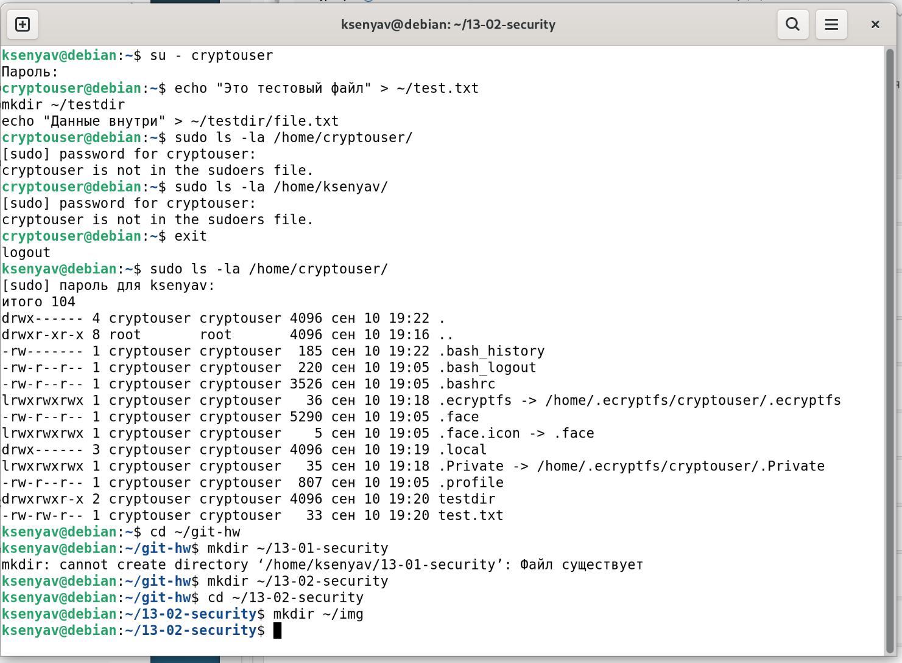
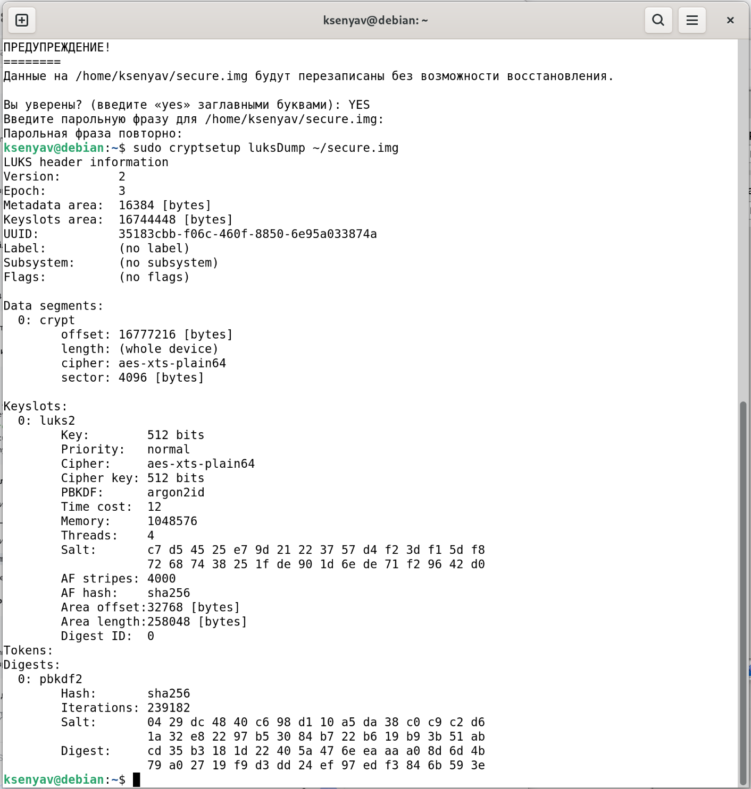
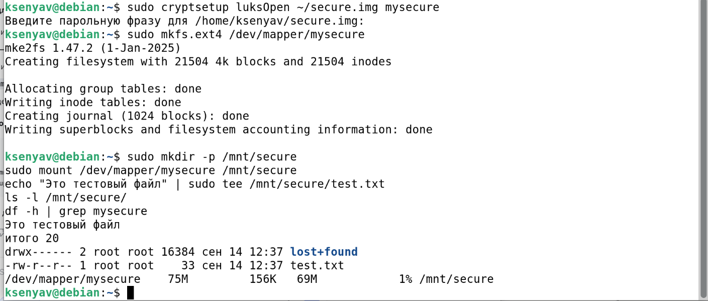
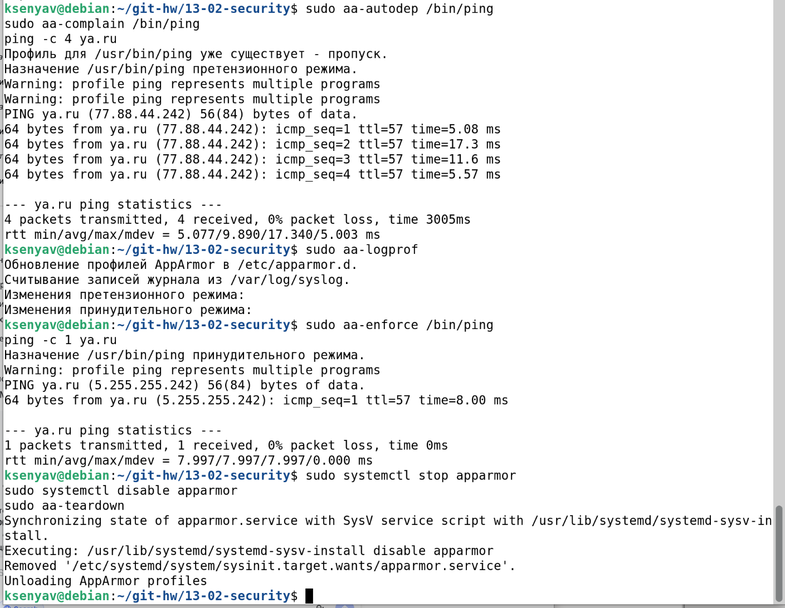

# Домашнее задание к занятию "13-02-security"

**Волчица Ксения**

---

## Задание 1. Шифрование домашнего каталога с помощью eCryptfs

## Задание 2. Шифрование раздела с помощью LUKS

## Задание 3*. Работа с AppArmor (дополнительное)

