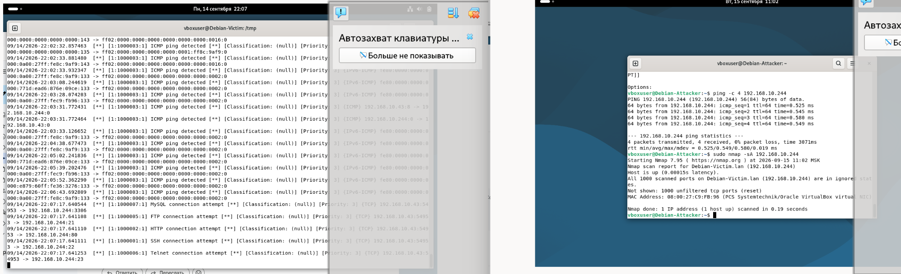
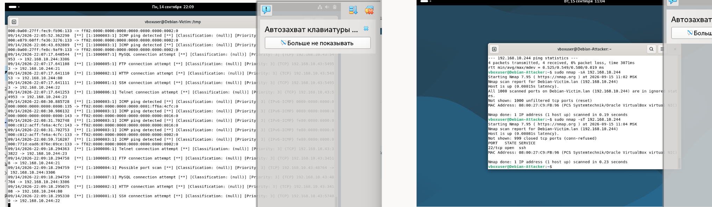
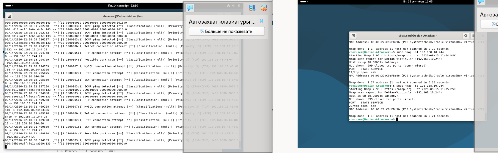
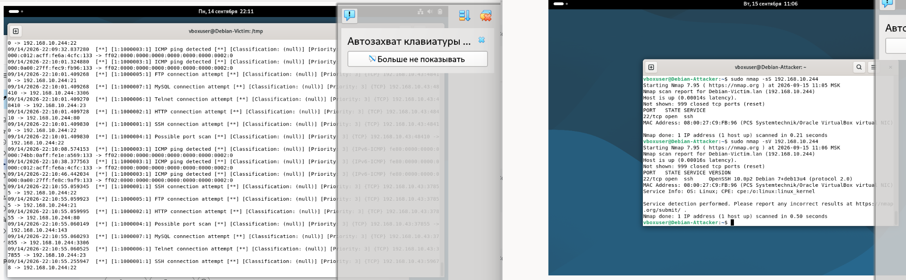
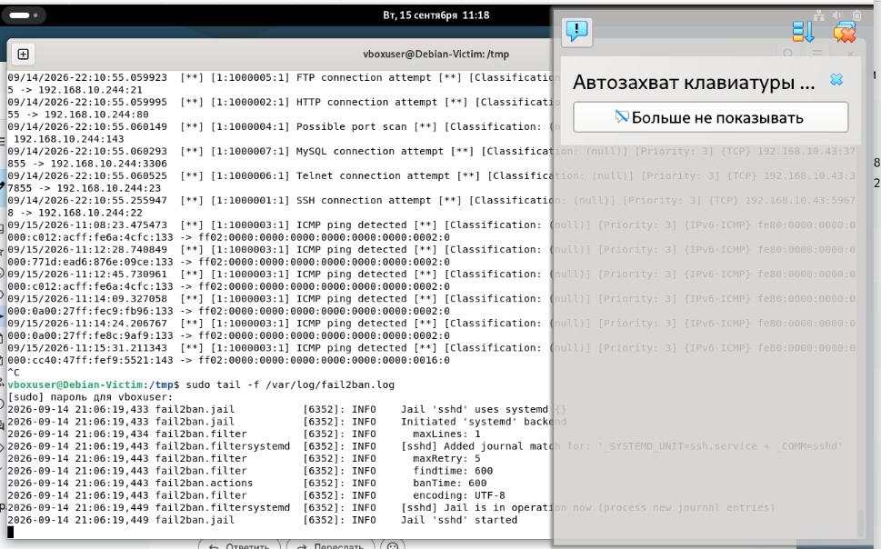
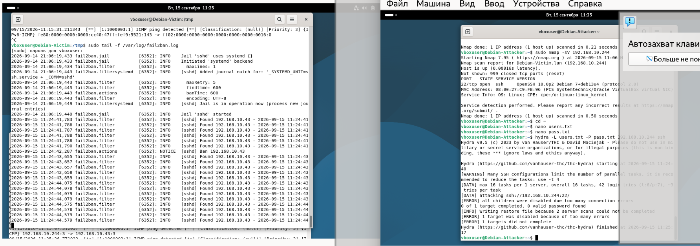
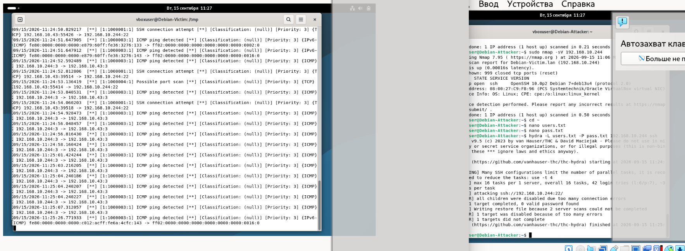

# Домашнее задание к занятию «Защита сети»

**Волчица Ксения**

---

## Цель работы

Настроить защиту системы с помощью Suricata и Fail2Ban, провести разведку и атаку на SSH, проанализировать логи.

---

## Схема стенда

| Роль | ВМ | IP | ПО |
|------|-----|-----|-----|
| **Жертва** | Debian-Victim | `192.168.10.244` | SSH, Suricata, Fail2Ban |
| **Атакующий** | Debian-Attacker | `192.168.10.43` | nmap, hydra |

Обе ВМ находятся в одной подсети `192.168.10.0/24` (режим «Сетевой мост» в VirtualBox).

## Задание 1. Разведка и логи

1. Какие сетевые службы запущены?

На Victim открыт порт 22/tcp (SSH). Остальные порты закрыты или отфильтрованы.
2. Что попало в логи Suricata?

Suricata зафиксировала:

    Множественные подключения к разным портам (SSH, HTTP, FTP, Telnet, MySQL) — это результат сканирования.

    Событие "Possible port scan" — Suricata распознала сканирование портов как атаку.

    ICMP ping — обнаружены ping-запросы от Attacker.

3. Что попало в логи Fail2Ban?

Fail2Ban не отреагировал, потому что:

    Он анализирует логи аутентификации (/var/log/auth.log), а не сетевой трафик.

    Сканирование портов не является попыткой аутентификации, поэтому Fail2Ban его игнорирует

## Задание 2. Атака SSH через Hydra

Выводы

    1) Suricata успешно обнаружила сканирование портов и множественные SSH-подключения, записав алерты в /var/log/suricata/fast.log.

    2) Fail2Ban сработал при брутфорсе SSH, заблокировав IP атакующего на 600 секунд после 3 неудачных попыток.

    3) Сканирование портов не является триггером для Fail2Ban, так как он анализирует только логи аутентификации.

    4) Комбинация Suricata + Fail2Ban обеспечивает эффективную защиту: Suricata фиксирует сетевые аномалии, Fail2Ban блокирует нарушителей.
