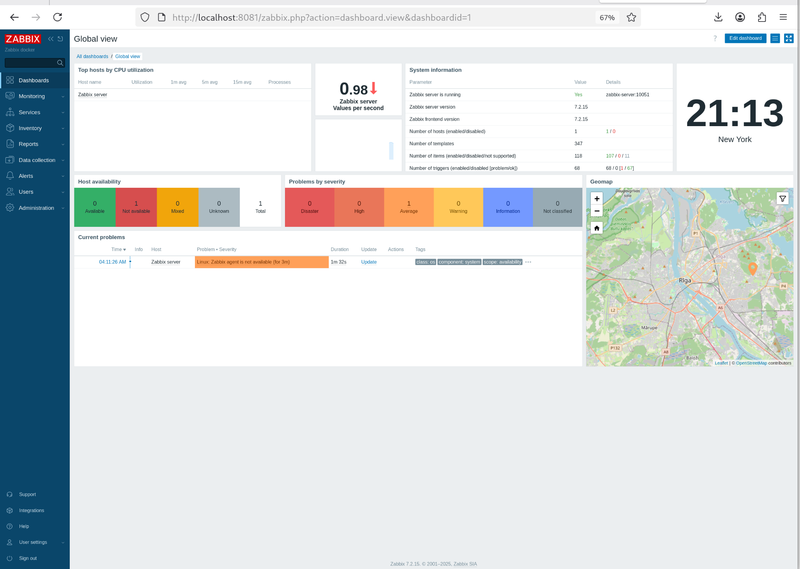
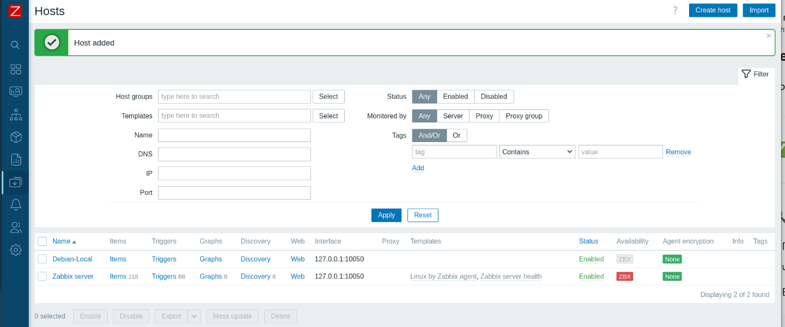
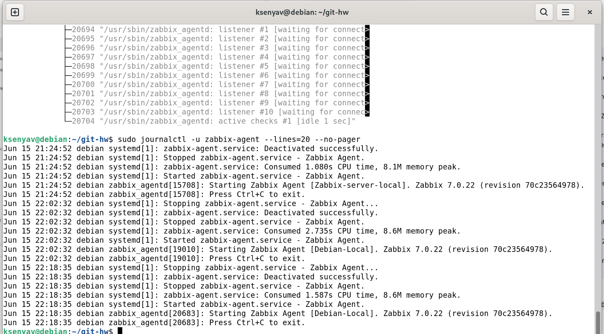
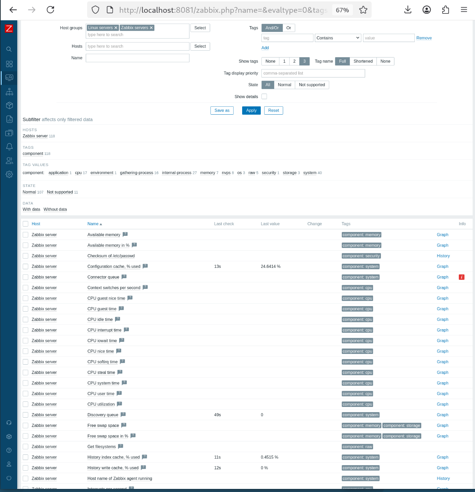
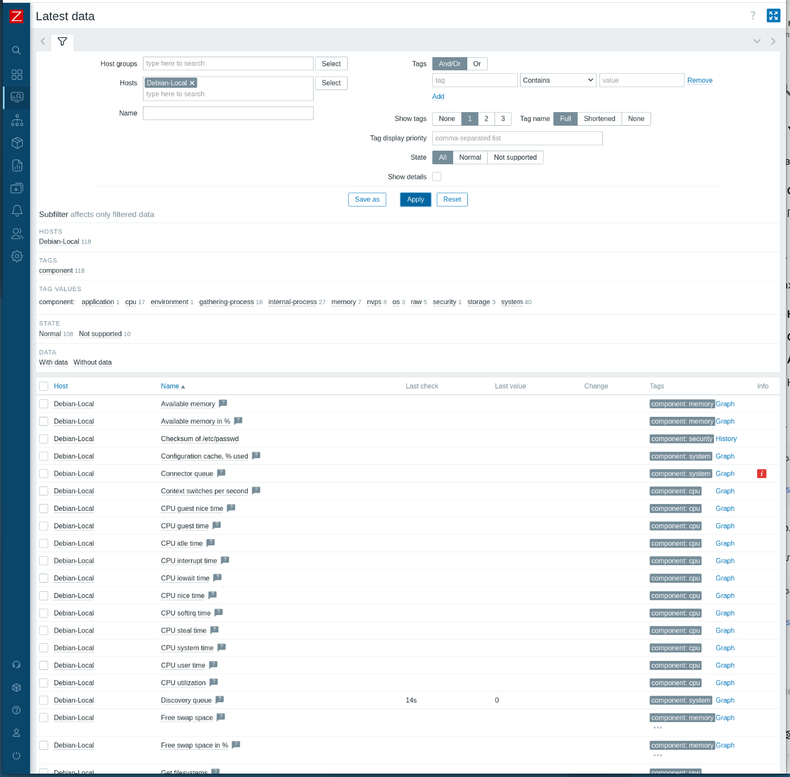

## Домашнее задание к занятию «Система мониторинга Zabbix»

**Студент:** Волчица Ксения

---

### Задание 1. Установка Zabbix Server с веб-интерфейсом

**Скриншот авторизации в админке:**

### Задание 1. Установка Zabbix Server с веб-интерфейсом

**Скриншот авторизации в админке:**

### Задание 2. Установка Zabbix Agent на два хоста

**Скриншот раздела Configuration > Hosts:**

**Скриншот лога zabbix agent:**

**Скриншот раздела Monitoring > Latest data:**

