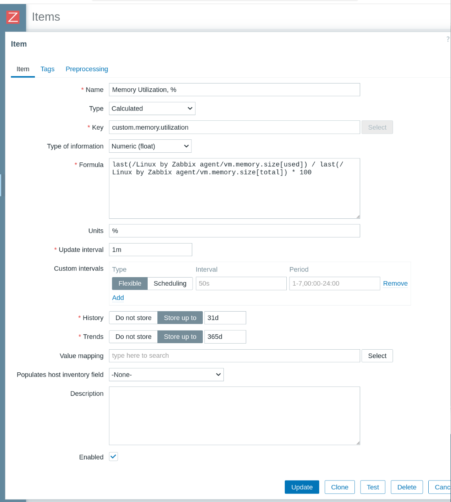
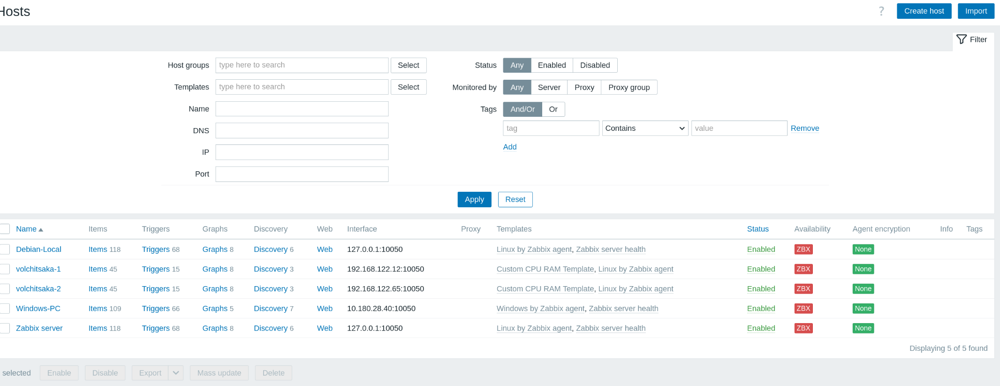
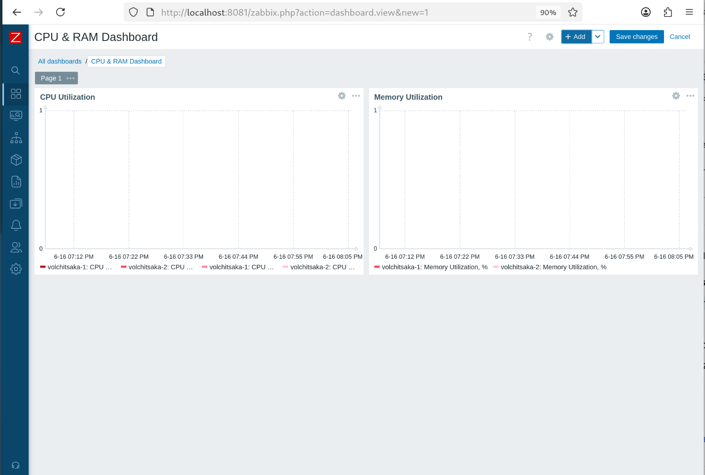
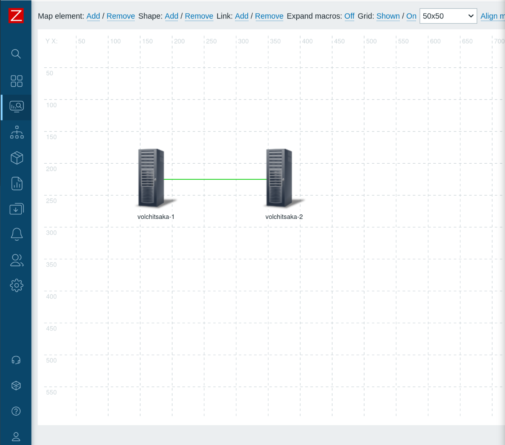
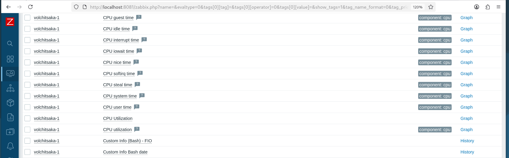

## Домашнее задание к занятию «Система мониторинга Zabbix. Часть 2»

**Студент:** Волчица Ксения

---

### Задание 1. Создание шаблона с элементами данных для CPU и RAM

**Скриншот страницы шаблона с названием «Задание 1»:**



---

### Задание 2-3. Добавление хостов и привязка шаблонов

**Скриншот страницы хостов, где видны привязки шаблонов с названиями «Задание 2-3». Хосты имеют зелёный статус подключения:**



---

### Задание 4. Создание кастомного дашборда

**Скриншот дашборда с названием «Задание 4»:**



---

### Задание 5* (со звёздочкой). Карта сети с триггером

**Скриншот карты, где видно, что триггер сработал, с названием «Задание 5»:**



---

### Задание 6* (со звёздочкой). UserParameter на Bash

**Скриншот Latest data с результатом работы скрипта на bash, где видны результаты при отправке в него 1 и 2:**



**Код скрипта `/usr/local/bin/my_info.sh`:**

```bash
#!/bin/bash
case $1 in
  1)
    echo "Volchitsa Ksenya"
    ;;
  2)
    date "+%Y-%m-%d %H:%M:%S"
    ;;
  *)
    echo "Usage: $0 {1|2}"
    ;;
esac
