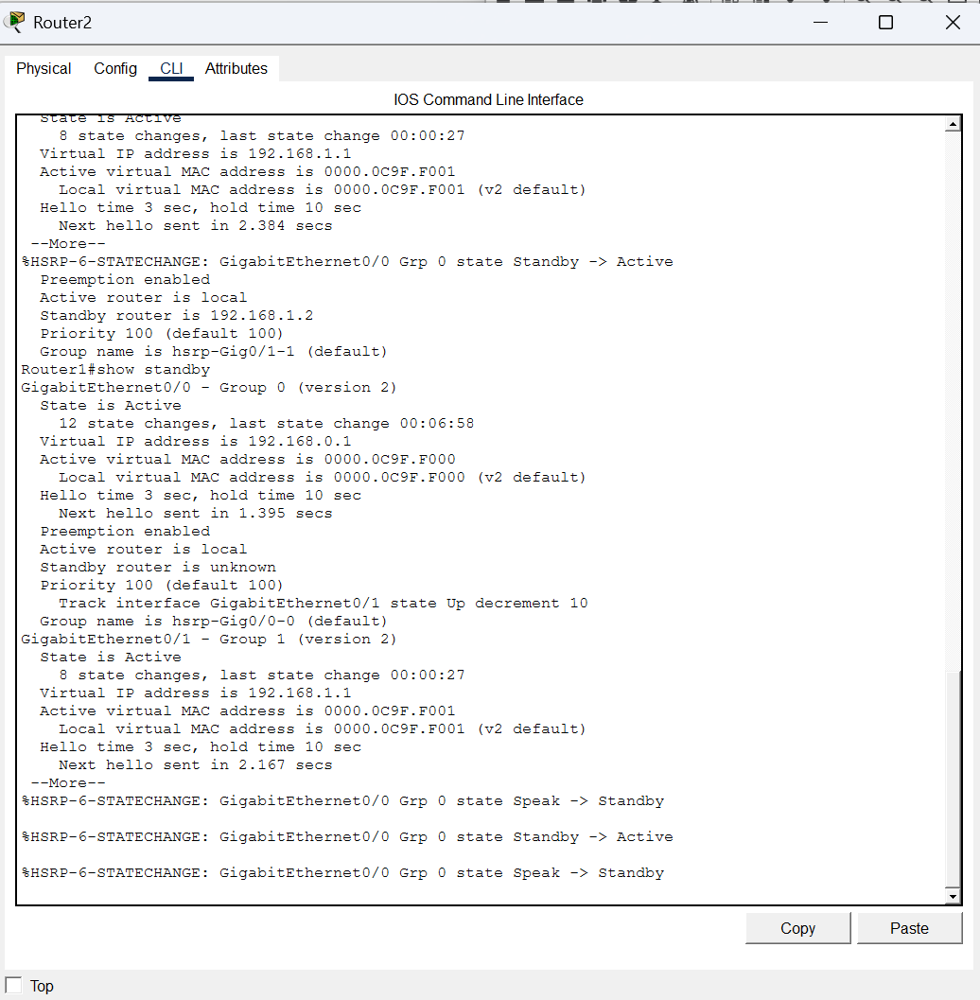
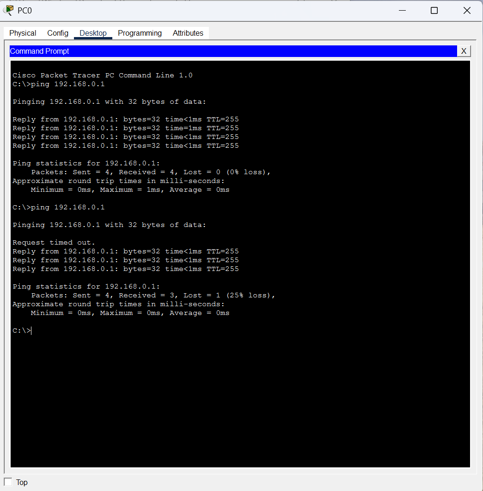

## Домашнее задание к занятию «Балансировка нагрузки и HA. Keepalived»

**Студент:** Волчица Ксения

---

### Задание 1. Настройка HSRP в Cisco Packet Tracer

#### Цель
Настроить отслеживание интерфейсов маршрутизаторов и проверить отказоустойчивость.

#### Настройка Router0 (MASTER)
```bash
enable
configure terminal
interface GigabitEthernet0/0
 ip address 192.168.0.2 255.255.255.0
 no shutdown
 standby 1 ip 192.168.0.254
 standby 1 priority 110
 standby 1 preempt
end
write memory
```

#### Настройка Router1 (BACKUP)
```bash
enable
configure terminal
interface GigabitEthernet0/0
 ip address 192.168.0.3 255.255.255.0
 no shutdown
 standby 1 ip 192.168.0.254
 standby 1 priority 90
 standby 1 preempt
end
write memory
```

#### Результат

    До разрыва кабеля: пинг до виртуального IP 192.168.0.1 идёт, Router0 активен.

    После разрыва кабеля: пинг продолжается, Router1 становится активным.

### Скриншоты

1. **Router0 (Active) — до разрыва**  
    
2. **Router1 (Standby) — до разрыва** 
    
3. **Router1 (Active) — после разрыва**
    
4. **Пинг до разрыва**
    
5. **Пинг после разрыва**
    

6. **Файл схемы:**
   

## Задание 2. Keepalived и веб-сервер на двух ВМ

### Настройка

- **MASTER:** debian-vm1 (IP: 192.168.122.65, приоритет 100)
- **BACKUP:** debian-vm2 (IP: 192.168.122.12, приоритет 90)
- **Виртуальный IP:** 192.168.122.100

### Скриншоты

1. **Виртуальный IP на MASTER до остановки nginx:**  
   

2. **Виртуальный IP на BACKUP после остановки nginx:**  
   

3. **Логи Keepalived на BACKUP (переключение):**  
   

### MASTER (debian-vm1) — /etc/keepalived/keepalived.conf:
```
vrrp_script chk_web {
    script "/usr/local/bin/check_web.sh"
    interval 3
    weight -20
}

vrrp_instance VI_1 {
    interface enp1s0
    state MASTER
    virtual_router_id 51
    priority 100
    advert_int 1
    authentication {
        auth_type PASS
        auth_pass 1234
    }
    virtual_ipaddress {
        192.168.122.100/24
    }
    track_script {
        chk_web
    }
}
```

### BACKUP (debian-vm2) — /etc/keepalived/keepalived.conf:
```
vrrp_script chk_web {
    script "/usr/local/bin/check_web.sh"
    interval 3
    weight -20
}

vrrp_instance VI_1 {
    interface enp1s0
    state BACKUP
    virtual_router_id 51
    priority 90
    advert_int 1
    authentication {
        auth_type PASS
        auth_pass 1234
    }
    virtual_ipaddress {
        192.168.122.100/24
    }
    track_script {
        chk_web
    }
}
```
### Скрипт проверки веб-сервера (/usr/local/bin/check_web.sh)
```
#!/bin/bash
nc -z -w 1 localhost 80 && [ -f /var/www/html/index.html ]
```

### Результат

    - Виртуальный IP переходит на BACKUP при остановке nginx на MASTER.

    - При восстановлении MASTER виртуальный IP возвращается обратно.

