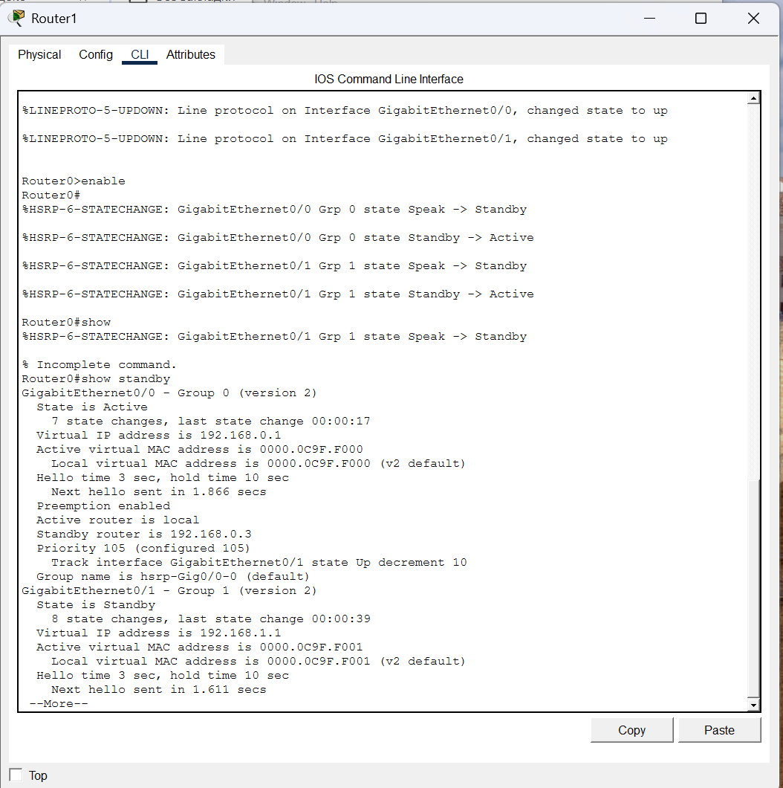
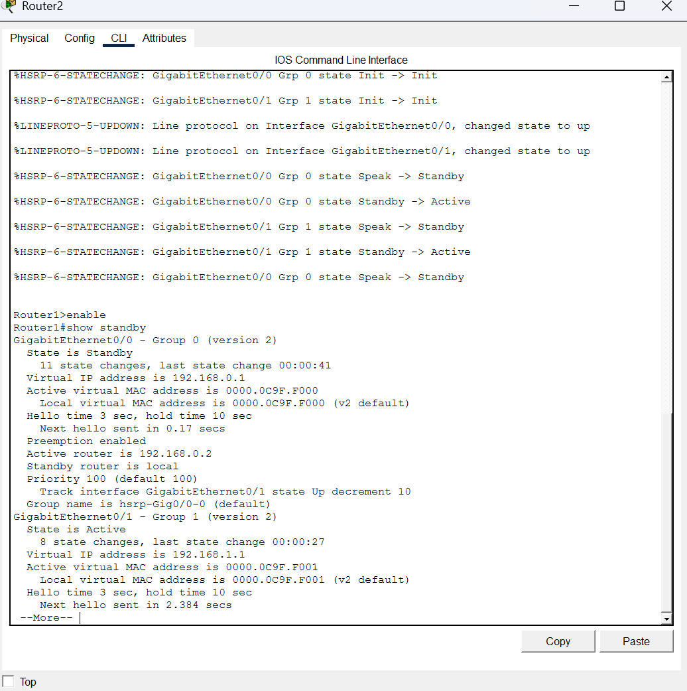
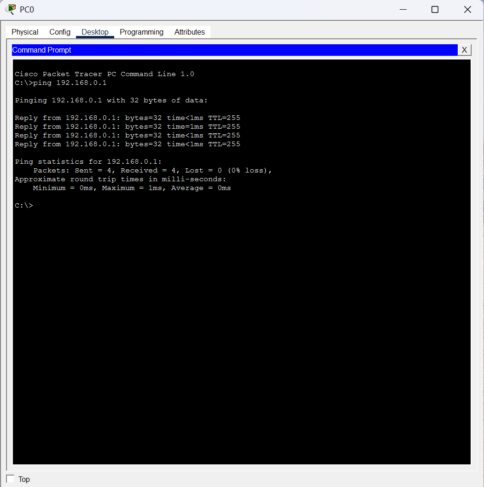
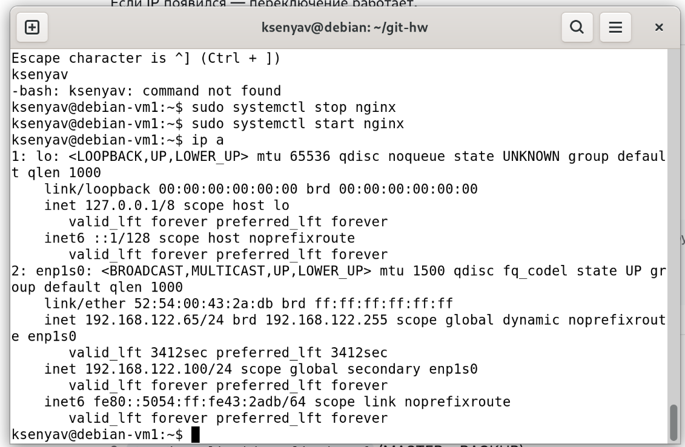
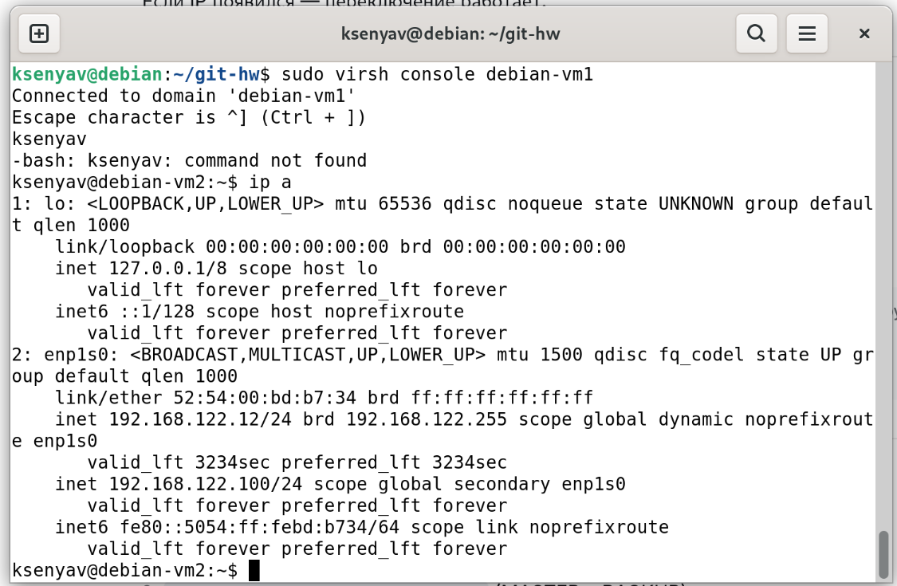
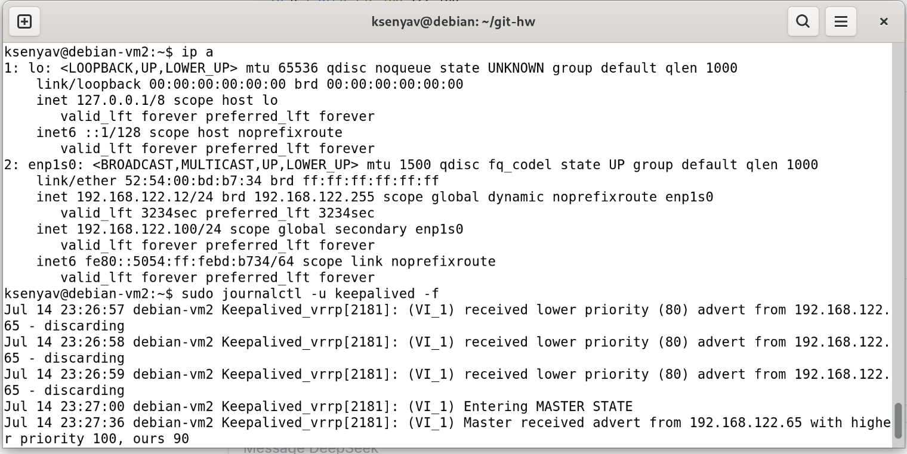

## Домашнее задание к занятию «Балансировка нагрузки и HA. Keepalived»

**Студент:** Волчица Ксения

---

### Задание 1. Настройка HSRP в Cisco Packet Tracer

#### Цель
Настроить отслеживание интерфейсов маршрутизаторов и проверить отказоустойчивость.

#### Настройка Router0 (MASTER)
```bash
enable
configure terminal
interface GigabitEthernet0/0
 ip address 192.168.0.2 255.255.255.0
 no shutdown
 standby 1 ip 192.168.0.254
 standby 1 priority 110
 standby 1 preempt
end
write memory
```

#### Настройка Router1 (BACKUP)
```bash
enable
configure terminal
interface GigabitEthernet0/0
 ip address 192.168.0.3 255.255.255.0
 no shutdown
 standby 1 ip 192.168.0.254
 standby 1 priority 90
 standby 1 preempt
end
write memory
```

#### Результат

    До разрыва кабеля: пинг до виртуального IP 192.168.0.1 идёт, Router0 активен.

    После разрыва кабеля: пинг продолжается, Router1 становится активным.

### Скриншоты

    

    

    

    

    

Файл схемы: hsrp_advanced.pkt

## Задание 2. Keepalived и веб-сервер на двух ВМ

### Настройка

- **MASTER:** debian-vm1 (IP: 192.168.122.65, приоритет 100)
- **BACKUP:** debian-vm2 (IP: 192.168.122.12, приоритет 90)
- **Виртуальный IP:** 192.168.122.100

### Скриншоты

1. **Виртуальный IP на MASTER до остановки nginx:**  
   

2. **Виртуальный IP на BACKUP после остановки nginx:**  
   

3. **Логи Keepalived на BACKUP (переключение):**  
   
