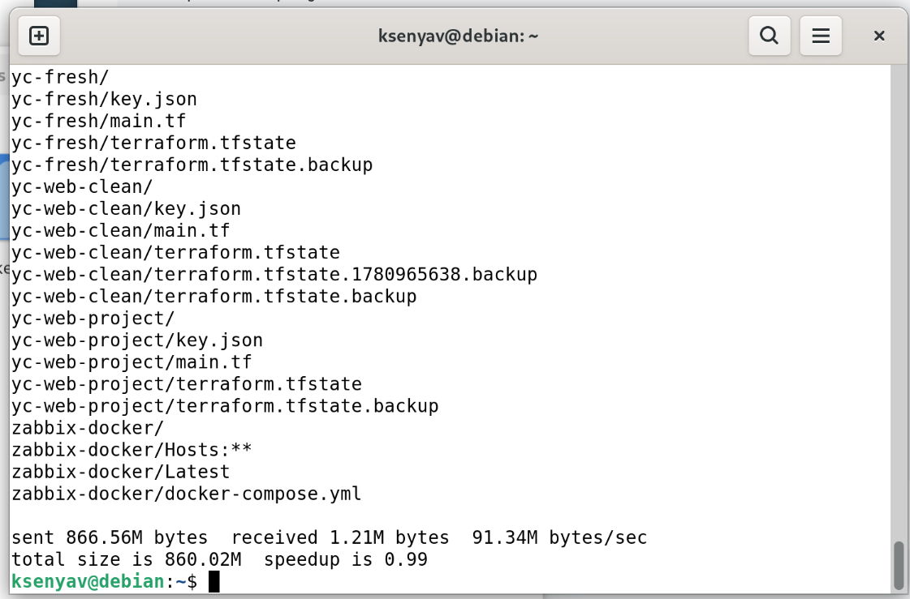
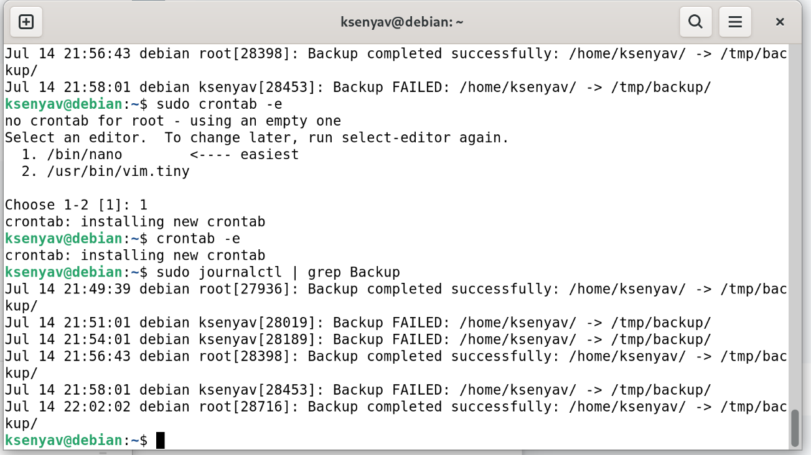
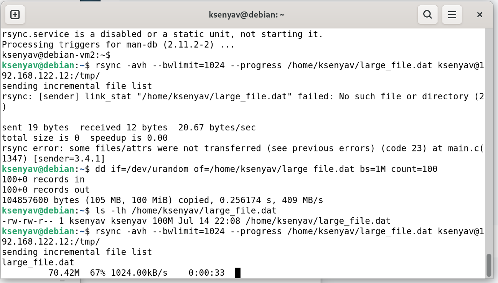
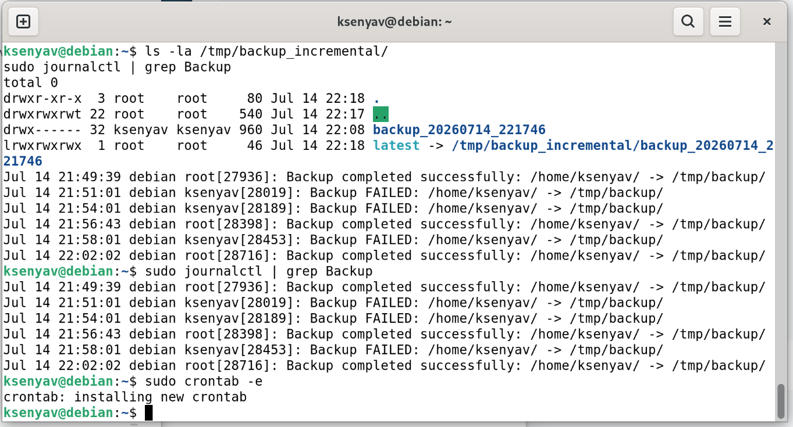

## Домашнее задание к занятию «Резервное копирование»

**Студент:** Волчица Ксения

---

### Настройка резервного копирования

#### Задание 1


    Составьте команду rsync, которая позволяет создавать зеркальную копию домашней директории пользователя в директорию /tmp/backup
    Необходимо исключить из синхронизации все директории, начинающиеся с точки (скрытые)
    Необходимо сделать так, чтобы rsync подсчитывал хэш-суммы для всех файлов, даже если их время модификации и размер идентичны в источнике и приемнике.
    На проверку направить скриншот с командой и результатом ее выполнения
```bash
rsync -avh --delete --checksum --exclude='.*' /home/ksenyav/ /tmp/backup/
```
**Пояснение параметров**

-a	Архивный режим (сохраняет права, владельцев, временные метки)
-v	Подробный вывод (verbose)
-h	Человеко-читаемый формат размеров
--delete	Удаляет файлы в целевом каталоге, которых нет в источнике (зеркало)
--checksum	Проверяет хэш-суммы файлов, даже если размер и время совпадают
--exclude='.*'	Исключает все скрытые файлы и папки, начинающиеся с точки
Результат

**Скриншот выполнения команды:**


---
#### Задание 2

    Написать скрипт и настроить задачу на регулярное резервное копирование домашней директории пользователя с помощью rsync и cron.
    Резервная копия должна быть полностью зеркальной
    Резервная копия должна создаваться раз в день, в системном логе должна появляться запись об успешном или неуспешном выполнении операции
    Резервная копия размещается локально, в директории /tmp/backup
    На проверку направить файл crontab и скриншот с результатом работы утилиты.

**Скрипт резервного копирования (/usr/local/bin/backup.sh)**
```bash
#!/bin/bash
# Скрипт ежедневного зеркального резервного копирования домашней директории

SOURCE="/home/ksenyav/"
DEST="/tmp/backup/"
LOG_FILE="/var/log/backup.log"

# Выполнение rsync с логированием
rsync -avh --delete --checksum --exclude='.*' "$SOURCE" "$DEST" >> "$LOG_FILE" 2>&1

# Проверка статуса и запись в системный лог
if [ $? -eq 0 ]; then
    logger "Backup completed successfully: $SOURCE -> $DEST"
    echo "$(date) - Backup successful" >> "$LOG_FILE"
else
    logger "Backup FAILED: $SOURCE -> $DEST"
    echo "$(date) - Backup FAILED" >> "$LOG_FILE"
    exit 1
fi
```
**Настройка cron (crontab -e)**
```bash
# Ежедневное резервное копирование в 02:00
0 2 * * * /usr/local/bin/backup.sh
```
**Скриншот работы cron:**


---
#### Задание 3 (со звёздочкой). Ограничение пропускной способности

    Настройте ограничение на используемую пропускную способность rsync до 1 Мбит/c
    Проверьте настройку, синхронизируя большой файл между двумя серверами
    На проверку направьте команду и результат ее выполнения в виде скриншота

```bash
rsync -avh --bwlimit=1024 --progress /home/ksenyav/large_file.dat user@192.168.122.100:/tmp/
```
**Скриншот выполнения:**


---
#### Задание 4* (со звёздочкой). Инкрементное копирование с ротацией

**Скрипт инкрементного бэкапа (/usr/local/bin/incremental_backup.sh)**
```bash
#!/bin/bash
# Инкрементное резервное копирование с ротацией (хранить 5 копий)

SOURCE="/home/ksenyav/"
BASE_DIR="/tmp/backup_incremental"
MAX_BACKUPS=5

# Создаём директорию для бэкапов
mkdir -p "$BASE_DIR"

# Формируем имя бэкапа с датой
BACKUP_NAME="backup_$(date +%Y%m%d_%H%M%S)"
BACKUP_PATH="$BASE_DIR/$BACKUP_NAME"

# Создаём полную копию (первый раз) или инкрементную
if [ ! -d "$BASE_DIR/latest" ]; then
    # Первый бэкап — полный
    mkdir -p "$BACKUP_PATH"
    rsync -avh --delete "$SOURCE" "$BACKUP_PATH/"
else
    # Инкрементный бэкап — используем --link-dest
    rsync -avh --delete --link-dest="$BASE_DIR/latest" "$SOURCE" "$BACKUP_PATH/"
fi

# Обновляем ссылку на последний бэкап
rm -f "$BASE_DIR/latest"
ln -s "$BACKUP_PATH" "$BASE_DIR/latest"

# Ротация: удаляем старые копии, оставляя только MAX_BACKUPS
cd "$BASE_DIR" || exit
BACKUPS=($(ls -1d backup_* 2>/dev/null | sort))
if [ ${#BACKUPS[@]} -gt $MAX_BACKUPS ]; then
    to_delete=$((${#BACKUPS[@]} - MAX_BACKUPS))
    for i in $(seq 0 $((to_delete - 1))); do
        rm -rf "${BACKUPS[$i]}"
    done
fi

# Логирование
logger "Incremental backup completed: $BACKUP_PATH"
echo "$(date) - Incremental backup: $BACKUP_PATH" >> /var/log/incremental_backup.log
```
**Скрипт восстановления (/usr/local/bin/restore.sh)**
```bash
#!/bin/bash
# Скрипт восстановления из выбранной резервной копии

BASE_DIR="/tmp/backup_incremental"
RESTORE_DIR="/home/ksenyav/restored"

echo "Доступные резервные копии:"
ls -1d "$BASE_DIR"/backup_* 2>/dev/null | xargs -n 1 basename

read -p "Введите имя копии для восстановления (например, backup_20250615_020000): " BACKUP_NAME

if [ -d "$BASE_DIR/$BACKUP_NAME" ]; then
    mkdir -p "$RESTORE_DIR"
    rsync -avh "$BASE_DIR/$BACKUP_NAME/" "$RESTORE_DIR/"
    echo "Восстановление завершено в $RESTORE_DIR"
    logger "Restored from backup: $BACKUP_NAME"
else
    echo "Ошибка: резервная копия не найдена"
    exit 1
fi
```

**Добавление в cron**
```bash
# Ежедневное инкрементное копирование в 03:00
0 3 * * * /usr/local/bin/incremental_backup.sh
```
**Скриншот выполнения:**

