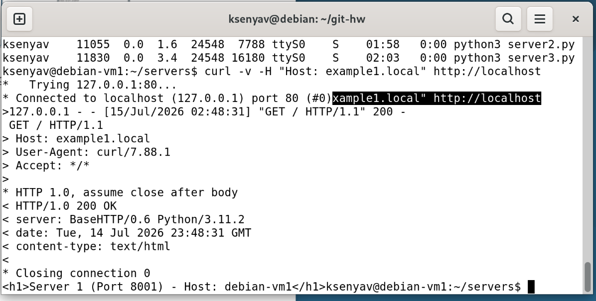
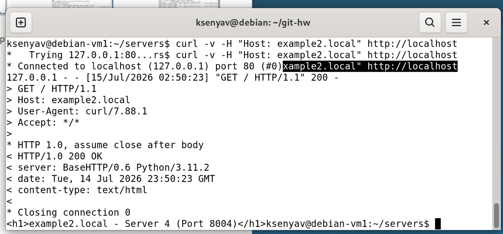
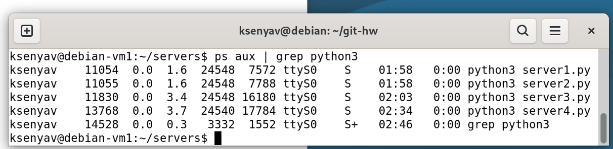
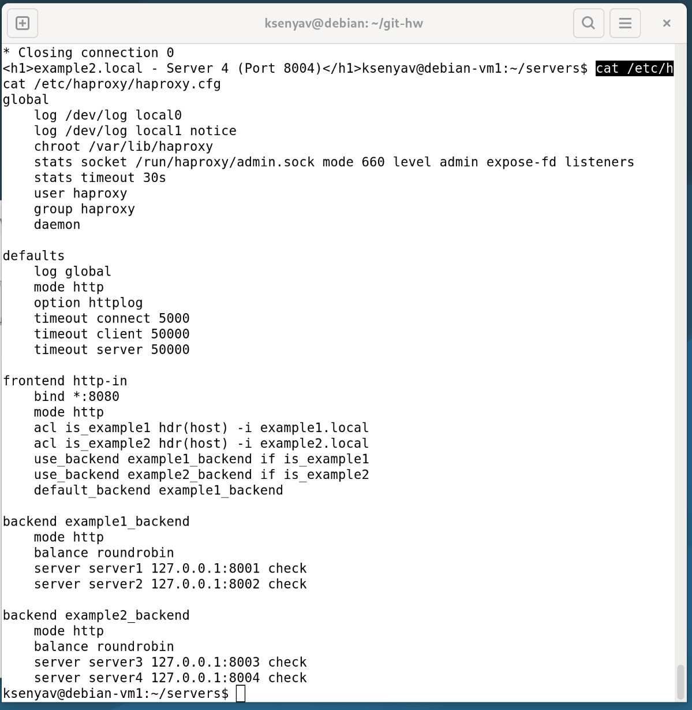

## Домашнее задание к занятию «Балансировка нагрузки. HAProxy/Nginx»

**Студент:** Волчица Ксения

---

### Задание 1. Запуск веб-серверов и настройка балансировки

#### Цель
Запустить два простых веб-сервера и настроить HAProxy для балансировки нагрузки между ними с использованием алгоритма Round-robin.

#### 1.1. Запуск двух HTTP-серверов

Для имитации работы бэкендов были запущены два простых Python-сервера на разных портах (8888 и 9999).

**Создание директорий и файлов:**

```bash
mkdir -p ~/http1 ~/http2
echo "<h1>Server 1 on port 8888</h1>" > ~/http1/index.html
echo "<h1>Server 2 on port 9999</h1>" > ~/http2/index.html
```
**Запуск серверов:**
```bash
cd ~/http1 && python3 -m http.server 8888 &
cd ~/http2 && python3 -m http.server 9999 &
```

#### 1.2. Запуск двух HTTP-серверов

**Установка HAProxy:**
```bash
sudo apt update
sudo apt install haproxy -y
```

**Конфигурационный файл** [Конфигурационный файл](files/haproxy.cfg)
Балансировка настроена на 4-м уровне (транспортном) модели OSI с использованием алгоритма Round-robin.
```bash
global
    log /dev/log local0
    log /dev/log local1 notice
    chroot /var/lib/haproxy
    stats socket /run/haproxy/admin.sock mode 660 level admin expose-fd listeners
    stats timeout 30s
    user haproxy
    group haproxy
    daemon

defaults
    log global
    mode http
    option httplog
    option dontlognull
    timeout connect 5000
    timeout client 50000
    timeout server 50000

frontend http_front
    bind *:8080
    default_backend servers

backend servers
    balance roundrobin
    server s1 127.0.0.1:8888 check
    server s2 127.0.0.1:9999 check

listen stats
    bind *:8404
    stats enable
    stats uri /stats
    stats refresh 10s
```
**Запуск HAProxy:**
```bash
sudo systemctl restart haproxy
sudo systemctl enable haproxy
```
#### 1.3. Проверка работы
При обращении к HAProxy на порту 8080 запросы поочерёдно перенаправляются на серверы s1 (порт 8888) и s2 (порт 9999).

**Скриншоты:**


### Задание 2. Настройка балансировки на 7-м уровне (HTTP)

#### Цель
Настроить HAProxy для балансировки на прикладном уровне, используя HTTP-заголовки (например, Host) для принятия решений о маршрутизации.

**Конфигурация**
В файл /etc/haproxy/haproxy.cfg добавлена секция frontend с использованием ACL для разделения трафика на основе доменного имени.

```bash
frontend http_front
    bind *:8080
    mode http

    acl host_example hdr(host) -i example.com
    use_backend servers_example if host_example

    default_backend servers
```
**Скриншоты:**


### Задание 3*. Связка HAProxy + Nginx

#### Цель
Nginx будет отдавать статику (картинки .jpg), а HAProxy — балансировать динамические запросы на два Python-сервера.

**Конфигурация**
В файл /etc/haproxy/haproxy.cfg добавлена секция listen stats.

```bash
listen stats
    bind *:8404
    stats enable
    stats uri /stats
    stats refresh 10s
```
**Доступ к статистике:** http://<IP_сервера>:8404/stats

**Скриншоты:**


```bash
global
    log /dev/log local0
    log /dev/log local1 notice
    chroot /var/lib/haproxy
    stats socket /run/haproxy/admin.sock mode 660 level admin expose-fd listeners
    stats timeout 30s
    user haproxy
    group haproxy
    daemon

defaults
    log global
    mode http
    option httplog
    option dontlognull
    timeout connect 5000
    timeout client 50000
    timeout server 50000

frontend http_front
    bind *:8080
    default_backend servers

backend servers
    balance roundrobin
    server s1 127.0.0.1:8888 check
    server s2 127.0.0.1:9999 check

listen stats
    bind *:8404
    stats enable
    stats uri /stats
    stats refresh 10s
```
**Настройка Nginx:**
```bash
server {
    listen 80 default_server;
    listen [::]:80 default_server;

    root /var/www/static;

    index index.html;

    server_name _;

    location / {
        # Все запросы, кроме .jpg, проксируем на HAProxy
        proxy_pass http://127.0.0.1:8080;
        proxy_set_header Host $host;
        proxy_set_header X-Real-IP $remote_addr;
    }

    location ~* \.jpg$ {
        # .jpg файлы отдаём напрямую
        root /var/www/static;
        try_files $uri =404;
    }
}
```

### Задание 4* (со звёздочкой). Виртуальные хосты на HAProxy

#### Цель
Настроить HAProxy для маршрутизации трафика на разные бэкенды в зависимости от домена (`example1.local` или `example2.local`).

#### Топология
- `example1.local` → backend_example1 (серверы на портах 8001, 8002)
- `example2.local` → backend_example2 (серверы на портах 8003, 8004)

#### Конфигурация HAProxy
[Конфигурация HAProxy](files/haproxy.cfg)

#### Результат
- Запросы к `example1.local` обслуживаются серверами 1 и 2.
- Запросы к `example2.local` обслуживаются серверами 3 и 4.

#### Скриншоты
1. **Запрос к example1.local:**  
   

2. **Запрос к example2.local:**  
   
   
3. **4 сервера работают:**


4. **конфа картинкой**
 
