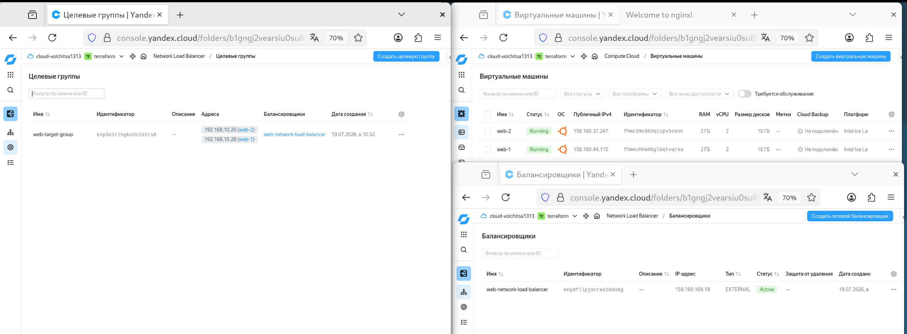
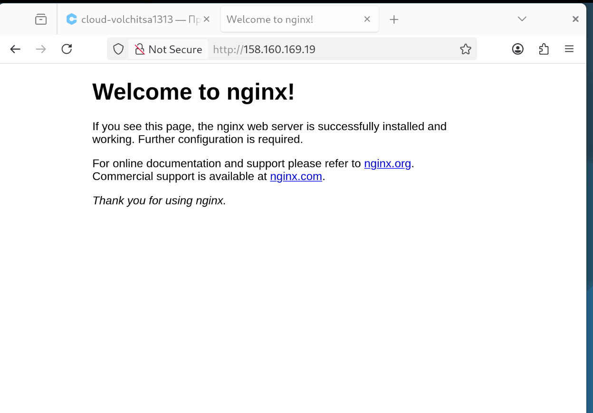
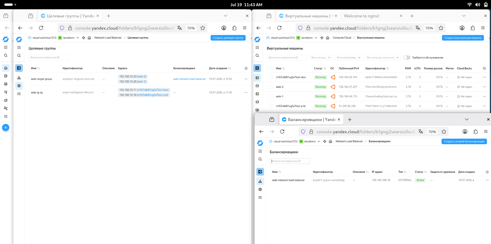
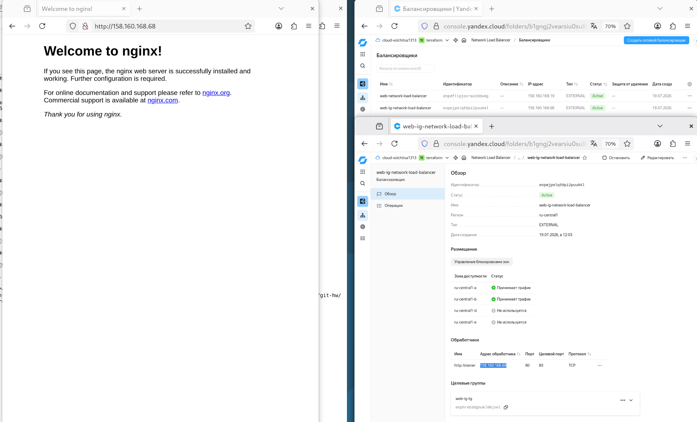

## Домашнее задание к занятию «Отказоустойчивость в облаке»

**Студент:** Волчица Ксения

---

### Задание 1. Создание двух ВМ и сетевого балансировщика

#### 1.1. Terraform Playbook

Файл `main.tf` для развёртывания двух идентичных ВМ, целевой группы и сетевого балансировщика.  
[Полный код Terraform](main.tf)

#### 1.2. Статус балансировщика и целевой группы

#### 1.3. Страница Nginx по внешнему IP балансировщика

---

### Задание 2* (со звёздочкой). Группа ВМ с балансировщиком

*(Выполняется по желанию. Если не делаешь — этот раздел можно удалить.)*

#### 2.1. Terraform Playbook для группы ВМ

[Полный код Terraform](main-group.tf)

#### 2.2. Статус группы ВМ и балансировщика

#### 2.3. Страница Nginx по внешнему IP балансировщика

---

**Ссылка на решение:**  
[https://github.com/kseniya-volchitsa/git-hw/tree/main/hw-06-cloud-ha](https://github.com/kseniya-volchitsa/git-hw/tree/main/hw-06-cloud-ha)
