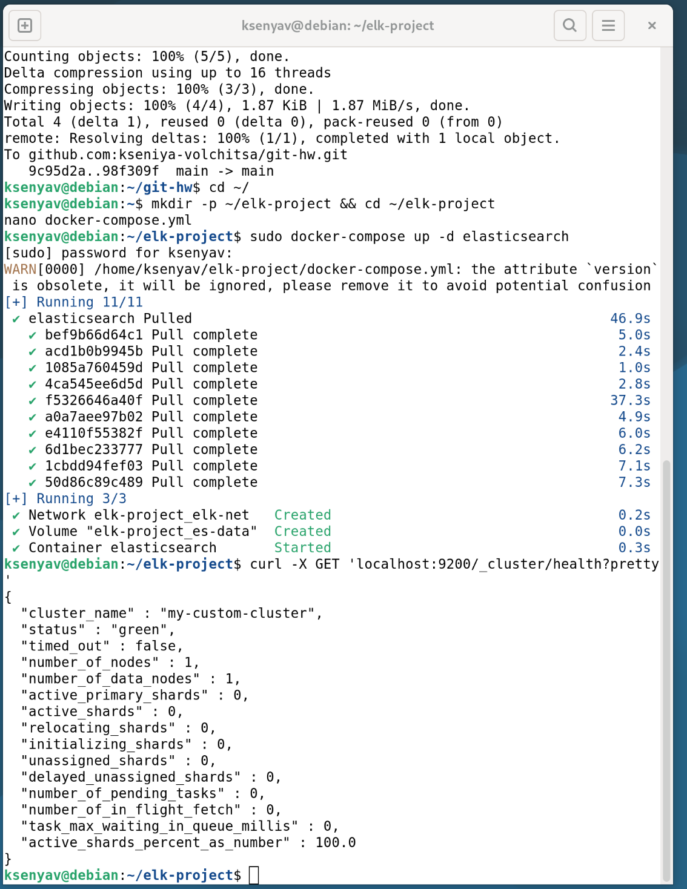
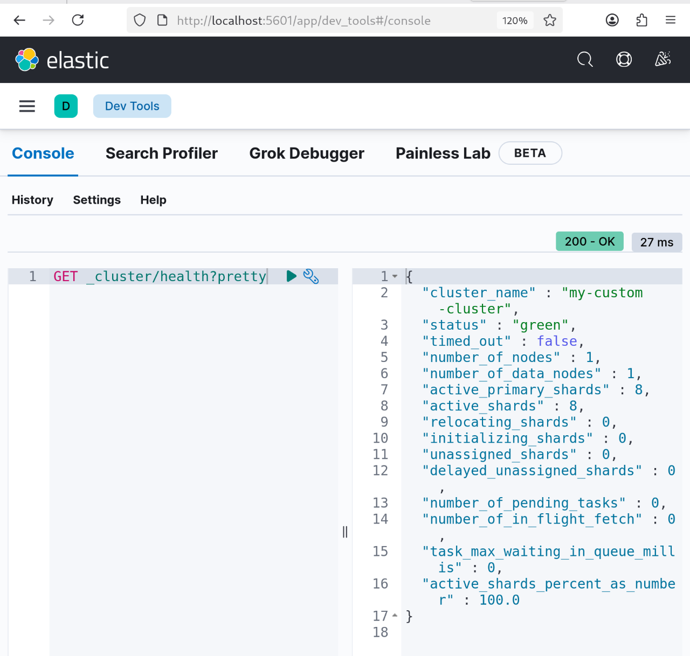
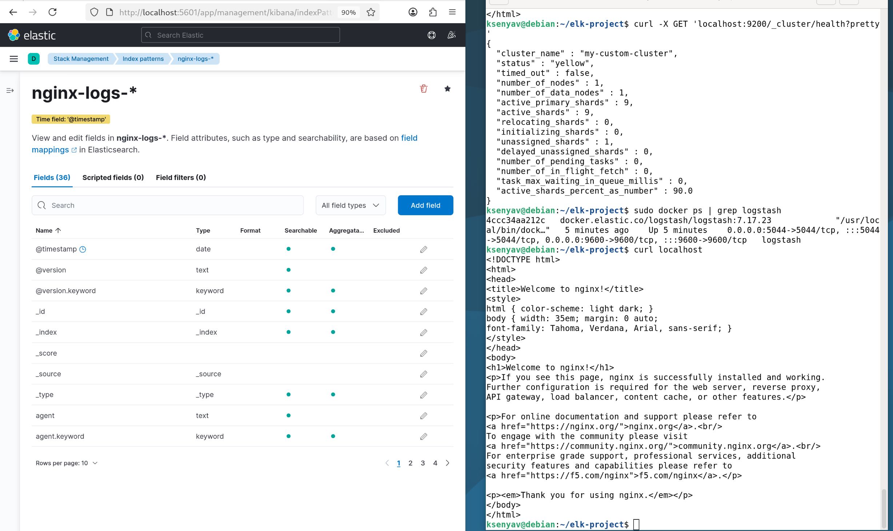
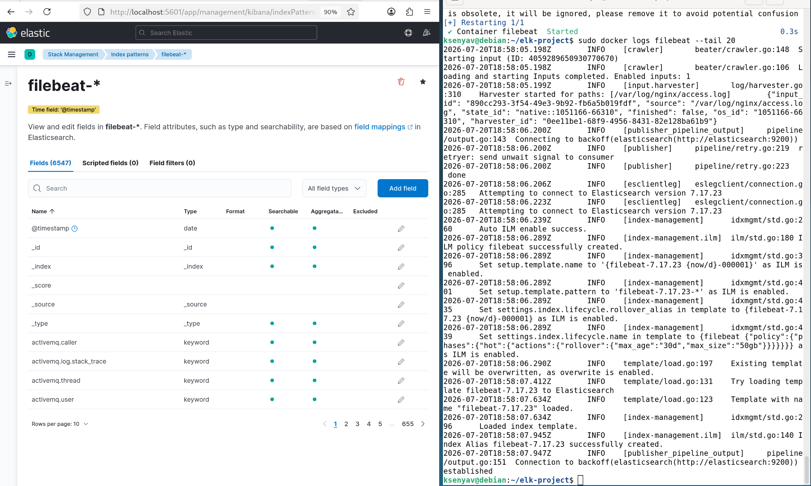
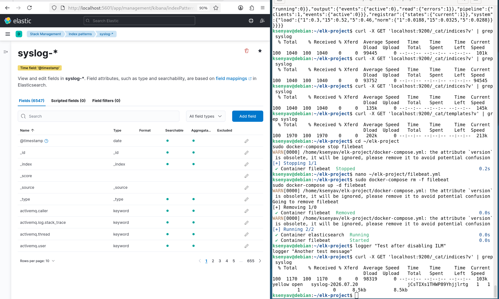

## Домашнее задание к занятию «ELK»

**Студент:** Волчица Ксения

---

### Задание 1. Elasticsearch

**Установка и запуск Elasticsearch (через Docker):**

Для выполнения задания использован Docker Compose.

**docker-compose.yml (часть для Elasticsearch):**

```yaml
version: '3.8'

services:
  elasticsearch:
    image: docker.elastic.co/elasticsearch/elasticsearch:7.17.23
    container_name: elasticsearch
    environment:
      - discovery.type=single-node
      - cluster.name=my-custom-cluster
      - ES_JAVA_OPTS=-Xms512m -Xmx512m
      - xpack.security.enabled=false
    ports:
      - "9200:9200"
      - "9300:9300"
    volumes:
      - es-data:/usr/share/elasticsearch/data
    networks:
      - elk-net

volumes:
  es-data:

networks:
  elk-net:
    driver: bridge
```

**Запуск Elasticsearch:**

```bash
sudo docker-compose up -d elasticsearch
```

**Проверка работы:**

```bash
curl -X GET 'localhost:9200/_cluster/health?pretty'
```

**Скриншот с нестандартным cluster_name (`my-custom-cluster`):**



---

### Задание 2. Kibana

**Добавление Kibana в docker-compose.yml:**

```yaml
kibana:
  image: docker.elastic.co/kibana/kibana:7.17.23
  container_name: kibana
  environment:
    - ELASTICSEARCH_HOSTS=http://elasticsearch:9200
  ports:
    - "5601:5601"
  networks:
    - elk-net
  depends_on:
    - elasticsearch
```

**Запуск Kibana:**

```bash
sudo docker-compose up -d kibana
```

**Скриншот Kibana Dev Tools с запросом `GET /_cluster/health?pretty`:**



---

### Задание 3. Logstash и Nginx

**Добавление Logstash и Nginx в docker-compose.yml:**

```yaml
logstash:
  image: docker.elastic.co/logstash/logstash:7.17.23
  container_name: logstash
  volumes:
    - ./logstash.conf:/usr/share/logstash/pipeline/logstash.conf
    - /var/log/nginx:/var/log/nginx:ro
  ports:
    - "5044:5044"
    - "9600:9600"
  networks:
    - elk-net
  depends_on:
    - elasticsearch

nginx:
  image: nginx:latest
  container_name: nginx
  ports:
    - "80:80"
  volumes:
    - /var/log/nginx:/var/log/nginx
  networks:
    - elk-net
```

**Конфигурация Logstash (`logstash.conf`):**

```ruby
input {
  file {
    path => "/var/log/nginx/access.log"
    start_position => "beginning"
  }
}

filter {
  grok {
    match => { "message" => "%{COMBINEDAPACHELOG}" }
  }
}

output {
  elasticsearch {
    hosts => ["elasticsearch:9200"]
    index => "nginx-logs-%{+YYYY.MM.dd}"
  }
}
```

**Запуск:**

```bash
sudo docker-compose up -d logstash nginx
curl localhost
```

**Скриншот Kibana с логами Nginx:**



---

### Задание 4. Filebeat

**Добавление Filebeat в docker-compose.yml:**

```yaml
filebeat:
  image: docker.elastic.co/beats/filebeat:7.17.23
  container_name: filebeat
  volumes:
    - ./filebeat.yml:/usr/share/filebeat/filebeat.yml:ro
    - /var/log/nginx:/var/log/nginx:ro
  networks:
    - elk-net
  depends_on:
    - elasticsearch
```

**Конфигурация Filebeat (`filebeat.yml`):**

```yaml
filebeat.inputs:
- type: log
  enabled: true
  paths:
    - /var/log/nginx/access.log

output.elasticsearch:
  hosts: ["elasticsearch:9200"]
  index: "filebeat-nginx-%{+YYYY.MM.dd}"
```

**Запуск:**

```bash
sudo docker-compose up -d filebeat
curl localhost
```

**Скриншот Kibana с логами Nginx через Filebeat:**



---

### Задание 5*. Доставка данных (дополнительное)

**Настройка поставки системных логов (`/var/log/syslog`):**

**Обновлённый `filebeat.yml`:**

```yaml
filebeat.inputs:
- type: log
  enabled: true
  paths:
    - /var/log/syslog

output.elasticsearch:
  hosts: ["elasticsearch:9200"]
  index: "syslog-%{+YYYY.MM.dd}"
```

**Скриншот Kibana с логами syslog:**



---

**Ссылка на решение:**  
[https://github.com/kseniya-volchitsa/git-hw/tree/main/hw-09-elk](https://github.com/kseniya-volchitsa/git-hw/tree/main/hw-09-elk)
