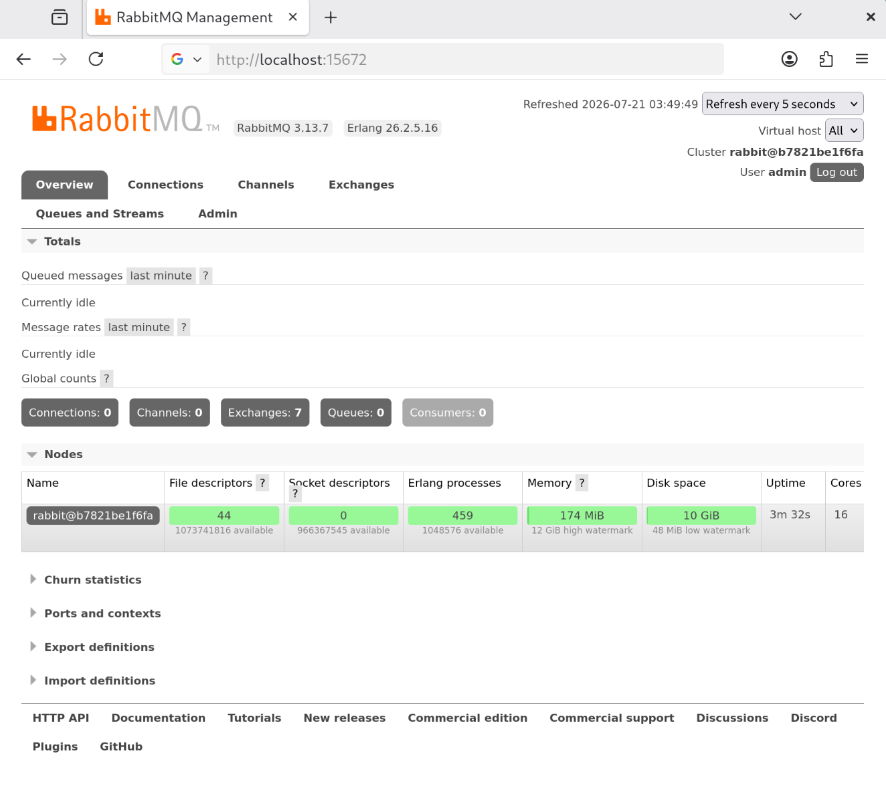
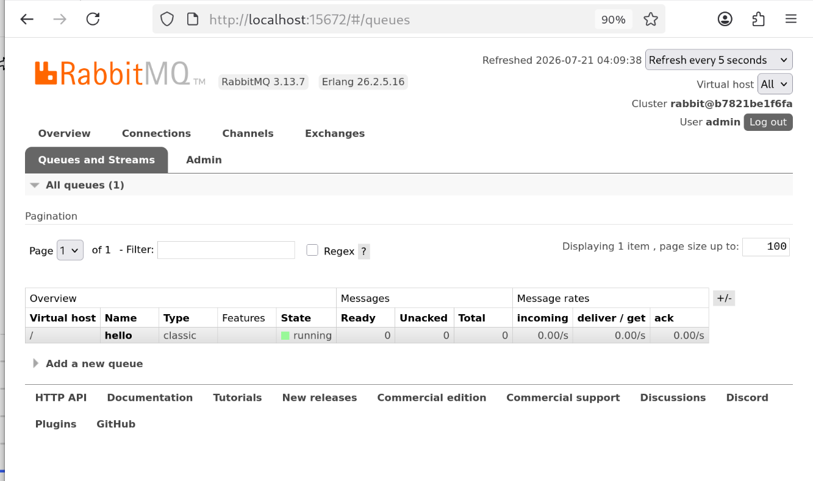
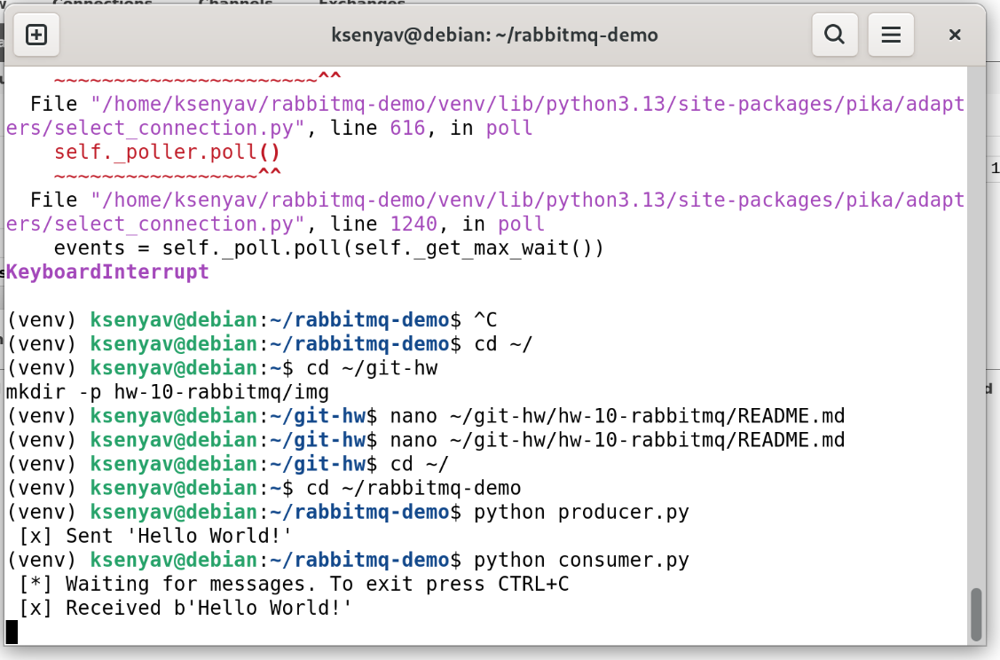
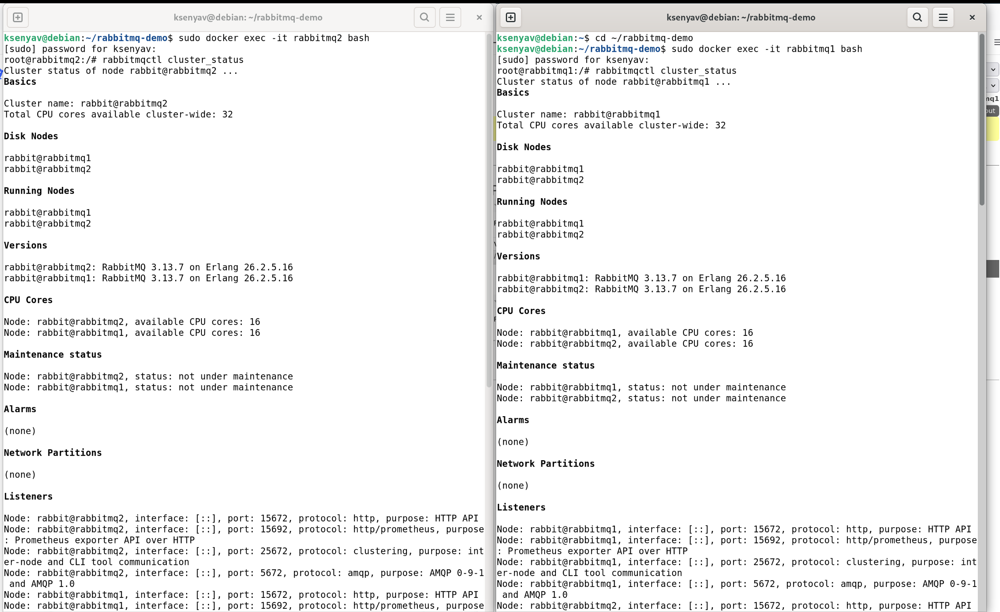
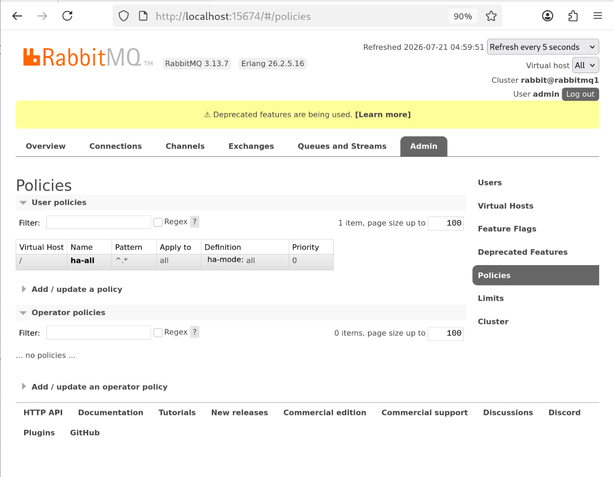
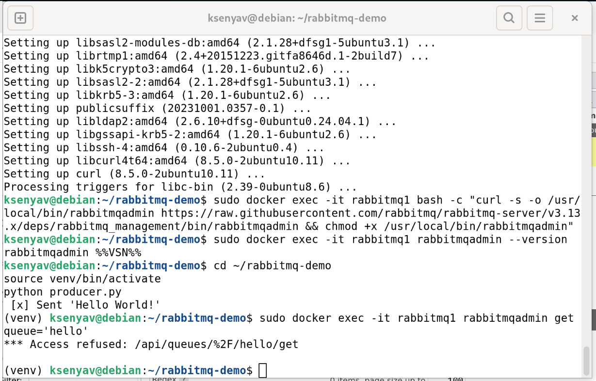
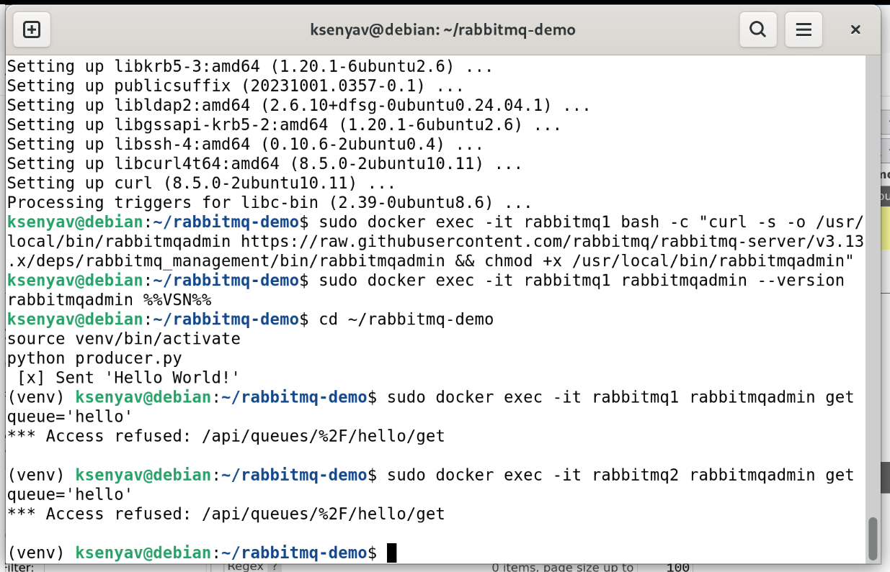
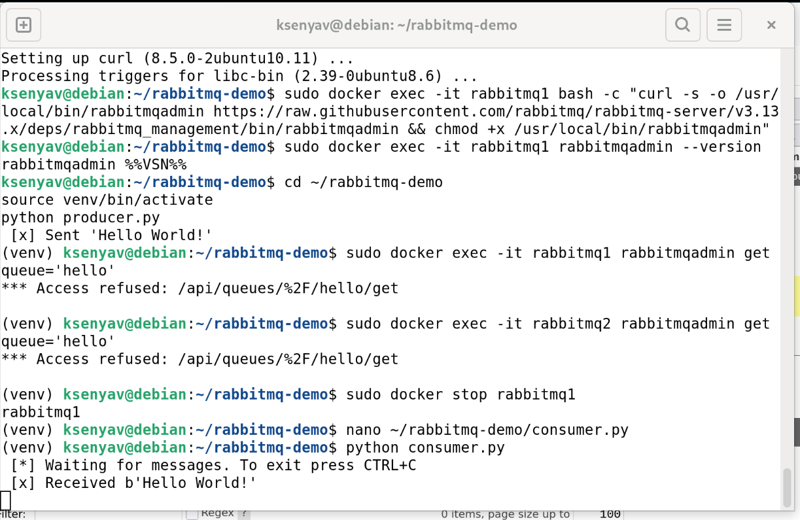
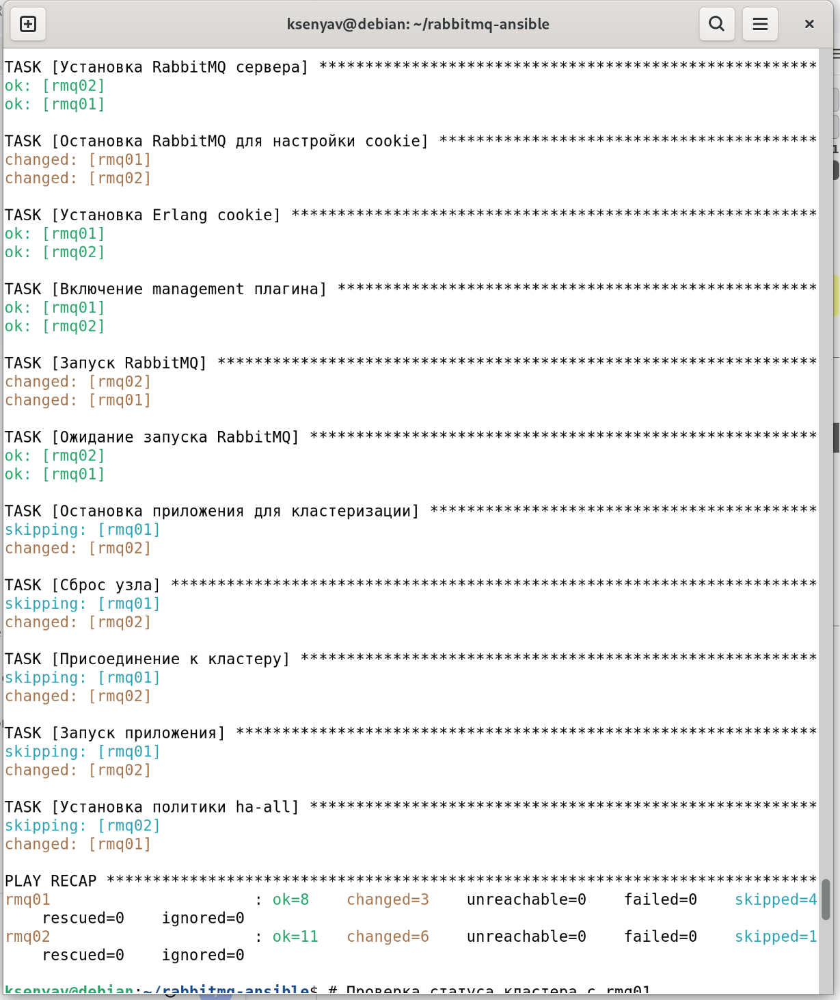

## Домашнее задание к занятию «Очереди RabbitMQ»

**Студент:** Волчица Ксения

---

### Задание 1. Установка RabbitMQ

#### Установка RabbitMQ на Debian (через Docker)

```bash
# Установка Docker (если не установлен)
sudo apt update
sudo apt install docker.io docker-compose -y

# Запуск RabbitMQ с management plug-in
sudo docker run -d --name rabbitmq \
  -p 5672:5672 \
  -p 15672:15672 \
  -e RABBITMQ_DEFAULT_USER=admin \
  -e RABBITMQ_DEFAULT_PASS=admin \
  rabbitmq:3-management
```
#### Проверка

- Веб-интерфейс: `http://<IP_сервера>:15672`
- Логин: `admin`
- Пароль: `admin`

**Скриншот веб-интерфейса RabbitMQ:**



--

### Задание 2. Отправка и получение сообщений

#### Установка Python и Pika

```bash
cd ~/
mkdir -p ~/rabbitmq-demo
cd ~/rabbitmq-demo
python3 -m venv venv
source venv/bin/activate
pip install pika
```

#### producer.py

```python
#!/usr/bin/env python3
import pika

credentials = pika.PlainCredentials('admin', 'admin')
parameters = pika.ConnectionParameters(
    host='localhost',
    credentials=credentials
)

connection = pika.BlockingConnection(parameters)
channel = connection.channel()

channel.queue_declare(queue='hello')

channel.basic_publish(exchange='', routing_key='hello', body='Hello World!')
print(" [x] Sent 'Hello World!'")
connection.close()
```

#### consumer.py

```python
#!/usr/bin/env python3
import pika

credentials = pika.PlainCredentials('admin', 'admin')
parameters = pika.ConnectionParameters(
    host='localhost',
    credentials=credentials
)

connection = pika.BlockingConnection(parameters)
channel = connection.channel()

channel.queue_declare(queue='hello')

def callback(ch, method, properties, body):
    print(" [x] Received %r" % body)

channel.basic_consume(queue='hello', on_message_callback=callback, auto_ack=True)

print(' [*] Waiting for messages. To exit press CTRL+C')
channel.start_consuming()
```
#### Запуск

```bash
python3 producer.py
python3 consumer.py
```

**Скриншот очереди hello в веб-интерфейсе:**



**Скриншот результата работы consumer.py:**



---
### Задание 3. Подготовка HA кластера

#### Создание двух ВМ с RabbitMQ

**На обеих ВМ:**

```bash
# Создание сети Docker
sudo docker network create rabbitmq-net

# Запуск первой ноды (rabbitmq1)
sudo docker run -d --name rabbitmq1 --network rabbitmq-net \
  --hostname rabbitmq1 \
  -p 5672:5672 -p 15672:15672 \
  -e RABBITMQ_DEFAULT_USER=admin \
  -e RABBITMQ_DEFAULT_PASS=admin \
  -e RABBITMQ_ERLANG_COOKIE=secretcookie \
  rabbitmq:3-management

# Запуск второй ноды (rabbitmq2)
sudo docker run -d --name rabbitmq2 --network rabbitmq-net \
  --hostname rabbitmq2 \
  -p 5673:5672 -p 15673:15672 \
  -e RABBITMQ_DEFAULT_USER=admin \
  -e RABBITMQ_DEFAULT_PASS=admin \
  -e RABBITMQ_ERLANG_COOKIE=secretcookie \
  rabbitmq:3-management
```

#### Объединение нод в кластер

```bash
# Вход во вторую ноду
sudo docker exec -it rabbitmq2 bash

# Остановка и сброс ноды
rabbitmqctl stop_app
rabbitmqctl reset

# Подключение к кластеру (используем полное имя первой ноды)
rabbitmqctl join_cluster rabbit@rabbitmq1

# Запуск приложения
rabbitmqctl start_app

# Проверка статуса кластера
rabbitmqctl cluster_status

# Выход из контейнера
exit
```

#### Создание политики ha-all

```bash
sudo docker exec -it rabbitmq1 bash
rabbitmqctl set_policy ha-all "^.*" '{"ha-mode":"all"}'
exit
```

#### Проверка статуса кластера

```bash
sudo rabbitmqctl cluster_status
```

**Скриншот веб-интерфейса с информацией о нодах кластера:**



**Скриншот с включённой политикой:**



**Вывод `rabbitmqctl cluster_status` на rmq01:**

```
Cluster status of node rabbit@rmq01 ...
Basics

Cluster name: rabbit@rmq01

Disk Nodes

rabbit@rmq01
rabbit@rmq02

Running Nodes

rabbit@rmq01
rabbit@rmq02
```

**Вывод `rabbitmqctl cluster_status` на rmq02:**

```
Cluster status of node rabbit@rmq02 ...
Basics

Cluster name: rabbit@rmq01

Disk Nodes

rabbit@rmq01
rabbit@rmq02

Running Nodes

rabbit@rmq01
rabbit@rmq02
```

#### Тестирование HA

**Запуск producer.py:**

```bash
python3 producer.py
```

**Получение сообщения с rmq01:**

```bash
sudo rabbitmqadmin get queue='hello'
```

**Скриншот выполнения команды на rmq01:**



**Получение сообщения с rmq02:**

```bash
sudo rabbitmqadmin get queue='hello'
```

**Скриншот выполнения команды на rmq02:**



#### Отключение ноды и проверка

**Остановка RabbitMQ на rmq01:**

```bash
sudo rabbitmqctl stop_app
```

**Запуск consumer.py, подключенного к rmq02:**

```bash
python3 consumer.py
```

**Скриншот результата работы consumer.py после отключения ноды:**



---

### Задание 4*. Ansible playbook

#### Описание

Написан Ansible playbook, который автоматически:
- Устанавливает RabbitMQ на произвольное количество нод
- Включает management plugin
- Объединяет ноды в кластер
- Создаёт политику ha-all для зеркалирования очередей
- Создаёт административного пользователя

#### Структура плейбука

```
rabbitmq-cluster/
├── inventory.ini # Инвентарный файл с хостами
├── group_vars/
│ └── all.yml # Глобальные переменные для всех хостов
├── rabbitmq-cluster.yml # Основной playbook
└── README.md # Документация
```
[Полный код inventory](rabbitmq-ansible/inventory.ini)

[Полный код group_vars](rabbitmq-ansible/group_vars/all.yaml)

[Полный код rabbitmq-cluster](rabbitmq-cluster.yaml)


**Скриншот выполнения команды на playbook:**




