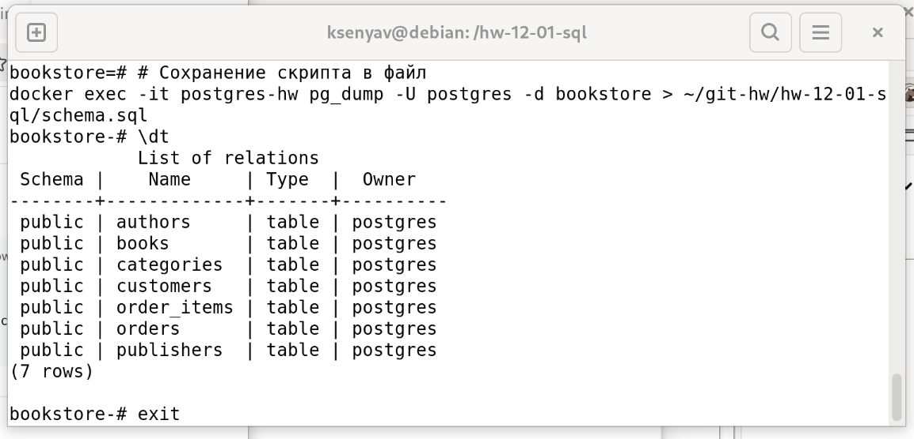

# Домашнее задание к занятию «Базы данных»

**Выполнила:** Ксения Волчица

---

## Задание 1

### Анализ исходных данных

На основе предоставленного Excel-файла, содержащего информацию о продажах книг, в>

### Таблицы базы данных

#### 1. **Таблица `authors` (Авторы)**
Хранит информацию об авторах книг.

| Столбец | Тип данных | Описание |
|---------|------------|----------|
| `author_id` | `SERIAL PRIMARY KEY` | Уникальный идентификатор автора |
| `first_name` | `VARCHAR(50)` | Имя автора |
| `last_name` | `VARCHAR(50)` | Фамилия автора |

#### 2. **Таблица `publishers` (Издательства)**
Хранит информацию об издательствах.

| Столбец | Тип данных | Описание |
|---------|------------|----------|
| `publisher_id` | `SERIAL PRIMARY KEY` | Уникальный идентификатор издательства |
| `name` | `VARCHAR(100)` | Название издательства |
| `city` | `VARCHAR(50)` | Город издательства |

#### 3. **Таблица `categories` (Категории книг)**
Хранит категории книг.

| Столбец | Тип данных | Описание |
|---------|------------|----------|
| `category_id` | `SERIAL PRIMARY KEY` | Уникальный идентификатор категории |
| `name` | `VARCHAR(50)` | Название категории |

#### 4. **Таблица `books` (Книги)**
Хранит информацию о книгах.

| Столбец | Тип данных | Описание |
|---------|------------|----------|
| `book_id` | `SERIAL PRIMARY KEY` | Уникальный идентификатор книги |
| `title` | `VARCHAR(200)` | Название книги |
| `author_id` | `INT REFERENCES authors(author_id)` | Внешний ключ к таблице авто>
| `publisher_id` | `INT REFERENCES publishers(publisher_id)` | Внешний ключ к таб>
| `category_id` | `INT REFERENCES categories(category_id)` | Внешний ключ к табли>
| `publication_year` | `INT` | Год издания |
| `price` | `DECIMAL(10,2)` | Цена книги |
| `stock_quantity` | `INT` | Количество на складе |

#### 5. **Таблица `customers` (Покупатели)**
Хранит информацию о покупателях.

| Столбец | Тип данных | Описание |
|---------|------------|----------|
| `customer_id` | `SERIAL PRIMARY KEY` | Уникальный идентификатор покупателя |
| `first_name` | `VARCHAR(50)` | Имя покупателя |
| `last_name` | `VARCHAR(50)` | Фамилия покупателя |
| `email` | `VARCHAR(100)` | Email покупателя |
| `phone` | `VARCHAR(20)` | Телефон покупателя |
| `registration_date` | `DATE` | Дата регистрации |

#### 6. **Таблица `orders` (Заказы)**
Хранит информацию о заказах.

| Столбец | Тип данных | Описание |
|---------|------------|----------|
| `order_id` | `SERIAL PRIMARY KEY` | Уникальный идентификатор заказа |
| `customer_id` | `INT REFERENCES customers(customer_id)` | Внешний ключ к таблиц>
| `order_date` | `TIMESTAMP` | Дата и время заказа |
| `delivery_address` | `VARCHAR(255)` | Адрес доставки |
| `total_amount` | `DECIMAL(10,2)` | Общая сумма заказа |
| `status` | `VARCHAR(20)` | Статус заказа |

#### 7. **Таблица `order_items` (Элементы заказа)**
Хранит информацию о позициях в заказе.
| Столбец | Тип данных | Описание |
|---------|------------|----------|
| `order_item_id` | `SERIAL PRIMARY KEY` | Уникальный идентификатор позиции |
| `order_id` | `INT REFERENCES orders(order_id)` | Внешний ключ к таблице заказов>
| `book_id` | `INT REFERENCES books(book_id)` | Внешний ключ к таблице книг |
| `quantity` | `INT` | Количество книг |
| `unit_price` | `DECIMAL(10,2)` | Цена за единицу |
| `discount` | `DECIMAL(5,2)` | Скидка в процентах |

### Схема базы данных



---

## Задание 2* (со звёздочкой)

### 1. Развертывание PostgreSQL

Для выполнения задания использован Docker-контейнер с PostgreSQL:

```bash
# Запуск контейнера PostgreSQL
docker run -d \
  --name postgres-hw \
  -e POSTGRES_PASSWORD=postgres_password \
  -e POSTGRES_DB=bookstore \
  -p 5432:5432 \
  postgres:15
```

```sql
# SQL скрипт для создания базы данных
-- Создание таблицы авторов
CREATE TABLE authors (
    author_id SERIAL PRIMARY KEY,
    first_name VARCHAR(50) NOT NULL,
    last_name VARCHAR(50) NOT NULL
);

-- Создание таблицы издательств
CREATE TABLE publishers (
    publisher_id SERIAL PRIMARY KEY,
    name VARCHAR(100) NOT NULL,
    city VARCHAR(50)
);

-- Создание таблицы категорий
CREATE TABLE categories (
    category_id SERIAL PRIMARY KEY,
    name VARCHAR(50) NOT NULL
);

-- Создание таблицы книг
CREATE TABLE books (
    book_id SERIAL PRIMARY KEY,
    title VARCHAR(200) NOT NULL,
    author_id INT REFERENCES authors(author_id),
    publisher_id INT REFERENCES publishers(publisher_id),
    category_id INT REFERENCES categories(category_id),
    publication_year INT CHECK (publication_year > 1900),
    price DECIMAL(10,2) CHECK (price >= 0),
    stock_quantity INT DEFAULT 0 CHECK (stock_quantity >= 0)
);

-- Создание таблицы покупателей
CREATE TABLE customers (
    customer_id SERIAL PRIMARY KEY,
    first_name VARCHAR(50) NOT NULL,
    last_name VARCHAR(50) NOT NULL,
    email VARCHAR(100) UNIQUE NOT NULL,
    phone VARCHAR(20),
    registration_date DATE DEFAULT CURRENT_DATE
);
-- Создание таблицы заказов
CREATE TABLE orders (
    order_id SERIAL PRIMARY KEY,
    customer_id INT REFERENCES customers(customer_id),
    order_date TIMESTAMP DEFAULT CURRENT_TIMESTAMP,
    delivery_address VARCHAR(255),
    total_amount DECIMAL(10,2),
    status VARCHAR(20) DEFAULT 'pending' CHECK (status IN ('pending', 'processing>
);

-- Создание таблицы элементов заказа
CREATE TABLE order_items (
    order_item_id SERIAL PRIMARY KEY,
    order_id INT REFERENCES orders(order_id) ON DELETE CASCADE,
    book_id INT REFERENCES books(book_id),
    quantity INT CHECK (quantity > 0),
    unit_price DECIMAL(10,2) CHECK (unit_price >= 0),
    discount DECIMAL(5,2) DEFAULT 0 CHECK (discount >= 0 AND discount <= 100)
);

-- Создание индексов для ускорения запросов
CREATE INDEX idx_books_author_id ON books(author_id);
CREATE INDEX idx_books_publisher_id ON books(publisher_id);
CREATE INDEX idx_books_category_id ON books(category_id);
CREATE INDEX idx_orders_customer_id ON orders(customer_id);
CREATE INDEX idx_order_items_order_id ON order_items(order_id);
CREATE INDEX idx_order_items_book_id ON order_items(book_id);

#Заполнение тестовыми данными
-- Добавление тестовых данных
INSERT INTO authors (first_name, last_name) VALUES
('Лев', 'Толстой'),
('Фёдор', 'Достоевский'),
('Александр', 'Пушкин');

INSERT INTO publishers (name, city) VALUES
('Эксмо', 'Москва'),
('Азбука', 'Санкт-Петербург'),
('АСТ', 'Москва');

INSERT INTO categories (name) VALUES
('Роман'),
('Поэзия'),
('Драма');

INSERT INTO books (title, author_id, publisher_id, category_id, publication_year,>
('Война и мир', 1, 1, 1, 1869, 599.00, 10),
('Преступление и наказание', 2, 2, 1, 1866, 450.00, 15),
('Евгений Онегин', 3, 3, 2, 1833, 299.00, 8);

INSERT INTO customers (first_name, last_name, email, phone) VALUES
('Иван', 'Петров', 'ivan@mail.ru', '+7-999-123-4567'),
('Мария', 'Иванова', 'maria@mail.ru', '+7-999-765-4321');

INSERT INTO orders (customer_id, delivery_address, total_amount, status) VALUES
(1, 'г. Москва, ул. Ленина, д. 1', 1049.00, 'delivered'),
(2, 'г. Санкт-Петербург, Невский пр., д. 10', 299.00, 'processing');

INSERT INTO order_items (order_id, book_id, quantity, unit_price, discount) VALUES
(1, 1, 1, 599.00, 0),
(1, 2, 1, 450.00, 0),
(2, 3, 1, 299.00, 0);
```

### Скриншот диаграммы в DBeaver 


