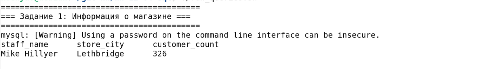
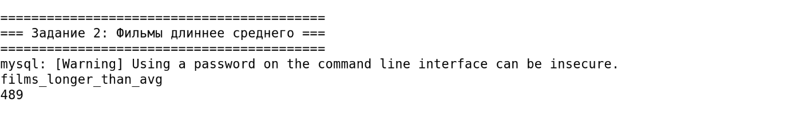
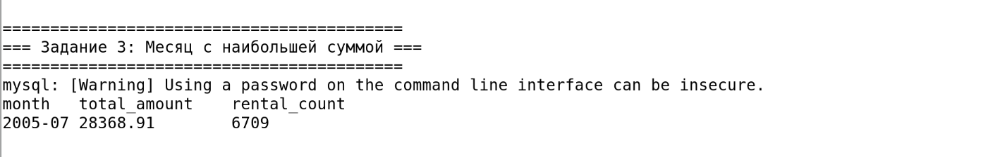
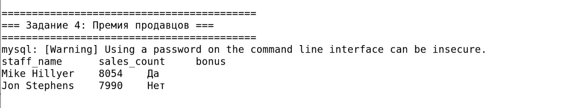
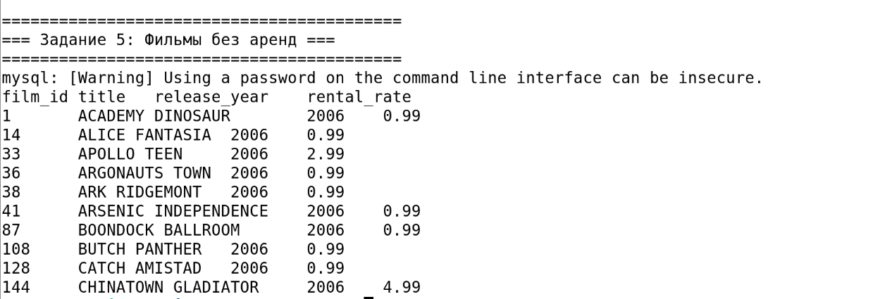

# Домашнее задание к занятию «SQL. Часть 2»

**Выполнила:** Ксения Волчица

---

### Решение

[script](run_queries.sh)

## Задание 1

Одним запросом получите информацию о магазине, в котором обслуживается более 300 покупателей, и выведите в результат следующую информацию:

    фамилия и имя сотрудника из этого магазина;
    город нахождения магазина;
    количество пользователей, закреплённых в этом магазине.

## Задание 2

Получите количество фильмов, продолжительность которых больше средней продолжительности всех фильмов.

## Задание 3

Получите информацию, за какой месяц была получена наибольшая сумма платежей, и добавьте информацию по количеству аренд за этот месяц.

## Задание 4

Посчитайте количество продаж, выполненных каждым продавцом. Добавьте вычисляемую колонку «Премия». Если количество продаж превышает 8000, то значение в колонке будет «Да», иначе должно быть значение «Нет».

## Задание 5

Найдите фильмы, которые ни разу не брали в аренду.

