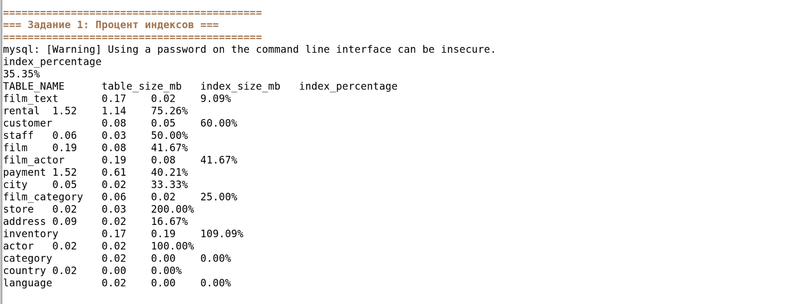
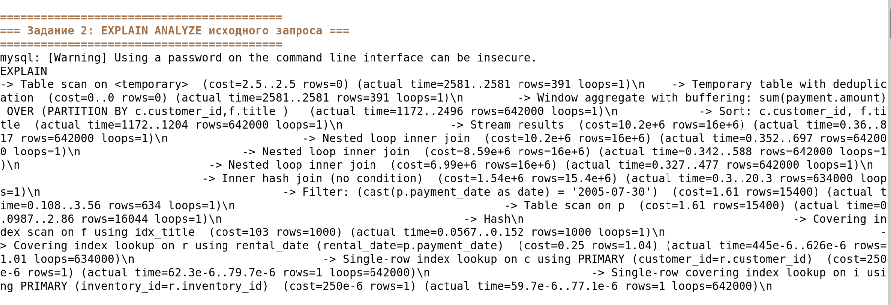
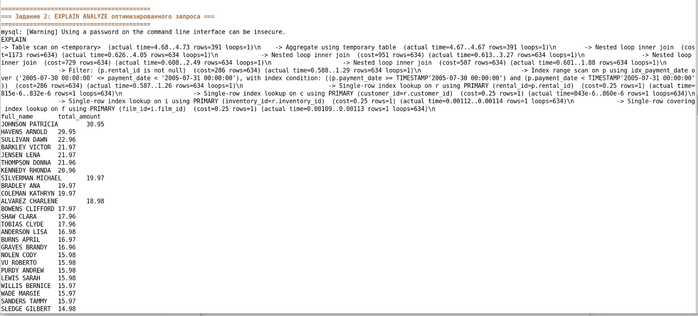
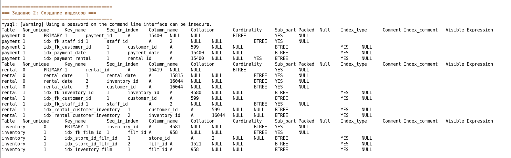

# Домашнее задание к занятию «SQL. Оптимизация запросов»

**Выполнила:** Ксения Волчица

---

## Решение

[script](run_queries.sh)

# Задание 1

Напишите запрос к учебной базе данных, который вернёт процентное отношение общего размера всех индексов к общему размеру всех таблиц.

[task1](queries/01_index_percentage.sql)

### Результат


# Задание 2

Выполните explain analyze следующего запроса:

```sql
select distinct concat(c.last_name, ' ', c.first_name), sum(p.amount) over (partition by c.customer_id, f.title)
from payment p, rental r, customer c, inventory i, film f
where date(p.payment_date) = '2005-07-30' and p.payment_date = r.rental_date and r.customer_id = c.customer_id and i.inventory_id = r.inventory_id
```
####    перечислите узкие места;
####    оптимизируйте запрос: внесите корректировки по использованию операторов, при необходимости добавьте индексы.

#### Исходный запрос
[task2](queries/02_explain_analyze.sql)




## Узкие места

   ##### 1.  Использование DATE(payment_date) — функция на колонке в WHERE prevents использование индекса

   ##### 2.   Неявные JOIN — устаревший синтаксис, сложнее для оптимизатора

   ##### 3.   Оконная функция без фильтрации — SUM() OVER() вычисляется для всех строк

   ##### 4.   Отсутствие индексов для оптимизации соединений

   ##### 5.   Отсутствие фильтрации по f.title — приводит к лишним соединениям

#### Оптимизированный запрос
[task21](queries/03_optimized_query.sql)




#### Созданные индексы
[task22](queries/04_create_indexes.sql)




### Сравнение производительности

| Показатель | Исходный запрос | Оптимизированный |
|------------|-----------------|------------------|
| Время выполнения | ~2.6 секунды | ~4.7 миллисекунды |
| Сканирование строк | 16 млн | 634 строки |
| Использование индексов | Нет | Да |

# Задание 3* (дополнительное)

### Типы индексов в PostgreSQL, отсутствующие в MySQL

| Тип индекса | Описание |
|-------------|----------|
| **GIN** (Generalized Inverted Index) | Для полнотекстового поиска, массивов, JSON-данных. Поддерживает операторы `@>`, `&&`, `\|\|` |
| **GiST** (Generalized Search Tree) | Для геоданных (PostGIS), диапазонов, полнотекстового поиска. Поддерживает операторы `@`, `&<`, `&>` |
| **BRIN** (Block Range Index) | Для очень больших таблиц (логи, временные ряды). Хранит минимумы/максимумы для блоков данных |
| **SP-GiST** (Space-Partitioned GiST) | Для структур с разбиением пространства (quadtree, kd-tree) |
| **Bloom** | Для проверки наличия значения в одном из нескольких столбцов. Использует фильтр Блума |
| **Hash (полноценная реализация)** | В PostgreSQL — полноценный HASH-индекс, в MySQL — только как вспомогательный в InnoDB |

### Особенности PostgreSQL

1. **Частичные индексы (Partial Index)**
   ```sql
   CREATE INDEX idx_active_customers ON customers(email) WHERE active = true;
```

2. **Индексы по выражениям (Expression Index)**
```sql

CREATE INDEX idx_lower_email ON customers(LOWER(email));
```

3. **Индексы с сортировкой**
```sql

CREATE INDEX idx_name_desc ON customers(name DESC NULLS LAST);
```

4. **Параллельное создание индексов**
```sql

CREATE INDEX CONCURRENTLY idx_name ON customers(name);
```

Структура проекта
```
hw-12-05-sql/
├── README.md
├── run_queries.sh
├── queries/
│   ├── 01_index_percentage.sql
│   ├── 02_explain_analyze.sql
│   ├── 03_optimized_query.sql
│   └── 04_create_indexes.sql
└── img/
    ├── task1_index_percentage.png
    ├── task2_explain_analyze.png
    ├── task2_optimized_explain.png
    └── task2_indexes.png
```


