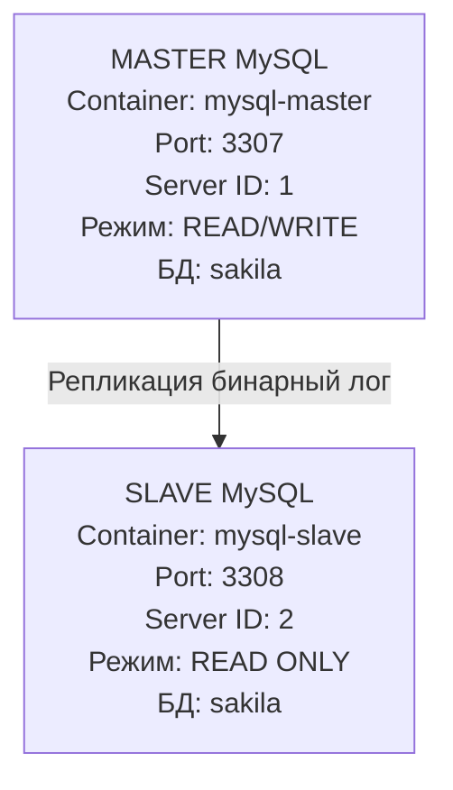
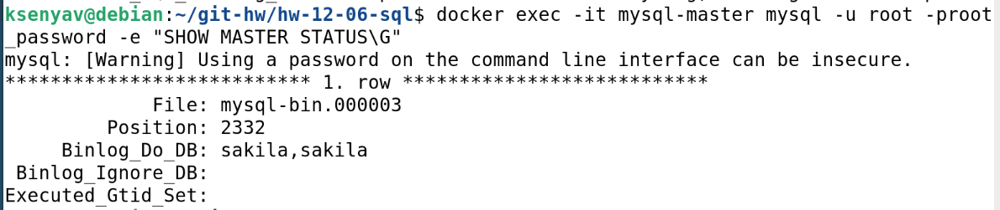
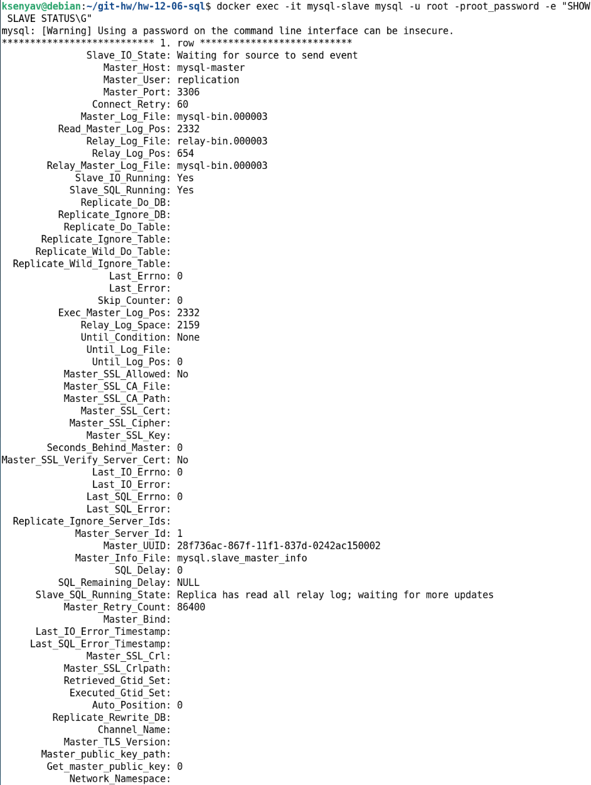
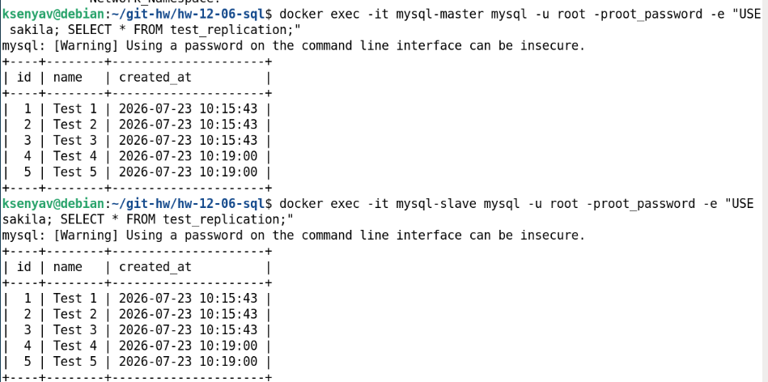
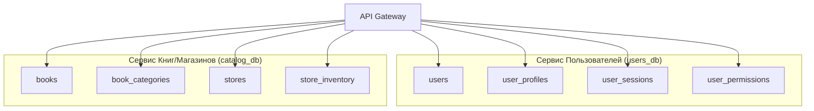
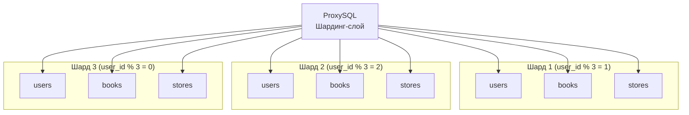
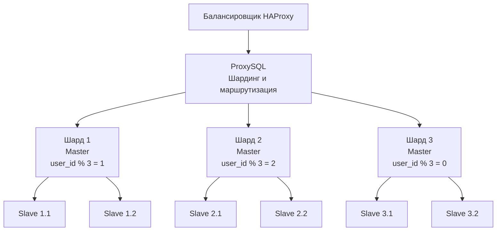
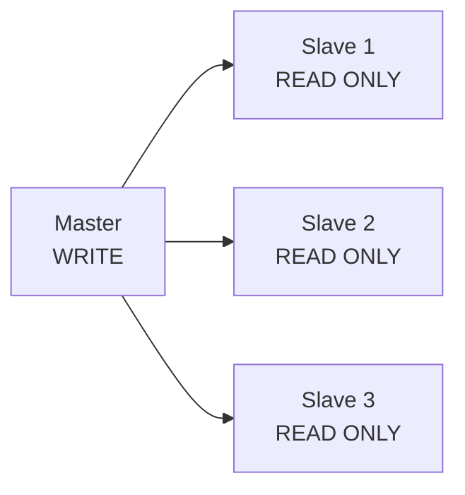

# Домашнее задание к занятию «Репликация и масштабирование»

**Выполнила:** Ксения Волчица

---

## Задание 1

Выполните конфигурацию master-slave репликации, примером можно пользоваться из лекции.

Приложите скриншоты конфигурации, выполнения работы: состояния и режимы работы серверов.

### Схема репликации

**Подготовка окружения**

Созданы два контейнера MySQL: mysql-master и mysql-slave.

**Конфигурация Docker Compose:**
[Файл конфигурации](docker-compose.yaml)

**Конфигурация Master**
[Файл конфигурации](master-config/my.cnf)

Основные параметры:

    - server-id = 1
    - Включён бинарный лог log-bin = mysql-bin
    - Формат лога ROW
    - Реплицируется только база sakila

Создание пользователя для репликации: user_settings.sql

**Конфигурация Slave**

[Файл конфигурации](slave-config/my.cnf)

Основные параметры:

    - server-id = 2
    - Режим read-only = 1
    - Включён relay-log

**Настройка репликации:**
[Настройка репликации](replication_settings.sql)

**Проверка работы репликации**
[Тестовый скрипт](test_1task.sql)

### Скриншоты

**Статус Master**

**Статус Slave**

**Проверка данных**

---

## Задание 2

Разработайте план для выполнения горизонтального и вертикального шаринга базы данных. База данных состоит из трёх таблиц:

    - пользователи,
    - книги,
    - магазины (столбцы произвольно).

Опишите принципы построения системы и их разграничение или разбивку между базами данных.

Пришлите блоксхему, где и что будет располагаться. Опишите, в каких режимах будут работать сервера.

### Вертикальный шардинг

| Сервис | Таблицы | Назначение |
|--------|---------|------------|
| Сервис пользователей | users, user_profiles, user_sessions | Аутентификация, профили |
| Сервис книг | books, book_categories, authors | Каталог книг |
| Сервис магазинов | stores, store_inventory, orders | Склад, продажи |

**Разделение таблиц по функциональному признаку:**

### Вертикальный шардинг

Преимущества:

    - Оптимизация под разные нагрузки
    - Независимое масштабирование
    - Разные СУБД для разных сервисов

Недостатки:

    - JOIN-запросы между сервисами сложны
    - Транзакции распределённые

### Горизонтальный шардинг

| Шард | Ключ | Таблицы |
|------|------|---------|
| Шард 1 | user_id % 3 = 1 | Все таблицы |
| Шард 2 | user_id % 3 = 2 | Все таблицы |
| Шард 3 | user_id % 3 = 0 | Все таблицы |

**Разделение данных по ключу:**

### Горизонтальный шардинг

### Режимы работы серверов

| Компонент | Режим | Назначение |
|-----------|-------|------------|
| Master (каждый шард) | READ/WRITE | Приём изменений |
| Slave (каждый шард) | READ ONLY | Чтение, отчёты |
| ProxySQL | Маршрутизация | Распределение запросов |
| HAProxy | Балансировка | Распределение нагрузки |

### Схема шардинга

---

## Задание 3*

Опишите основные преимущества использования масштабирования методами:

    - активный master-сервер и пассивный репликационный slave-сервер;
    - master-сервер и несколько slave-серверов;
    - активный сервер со специальным механизмом репликации — distributed replicated block device (DRBD);
    - SAN-кластер.

Дайте ответ в свободной форме.

### Сравнение методов масштабирования

| Метод | Описание | Преимущества | Недостатки |
|-------|----------|--------------|------------|
| **Active Master + Passive Slave** | Один мастер принимает запись, один слейв для чтения и бэкапа | Простота, резервирование | Ограниченная производительность |
| **Master + Multiple Slaves** | Один мастер для записи, много слейвов для чтения | Горизонтальное масштабирование чтения | Сложность синхронизации |
| **DRBD** (Distributed Replicated Block Device) | Синхронизация на уровне блоков (SAN) | Высокая надёжность, быстрый failover | Дорого, сложно |
| **SAN-кластер** | Общее хранилище для всех узлов | Простота управления, консистентность | Очень дорого, единая точка отказа |

### Схемы работы

**Active Master + Passive Slave:**

**Master + Multiple Slaves:**

---

## Задание 4*

Выполните настройку выбранных методов шардинга из задания 2.

Пришлите конфиг Docker и SQL скрипт с командами для базы данных.

**Docker Compose для шардинга:**
[Конфигурация шардинга](docker-compose-shard.yml)

**SQL скрипт для шардинга:** 
[Настройка шардинга](sharding_setup.sql)
