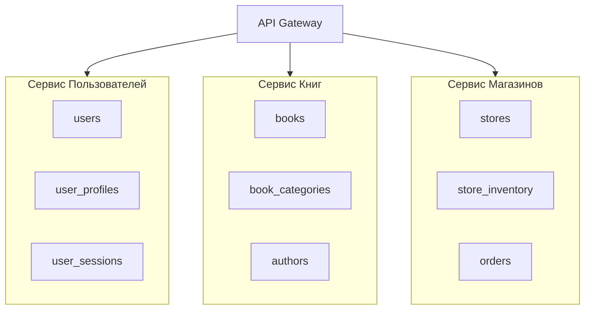
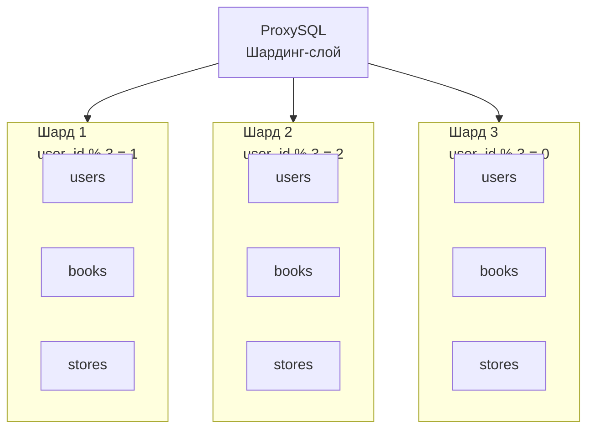
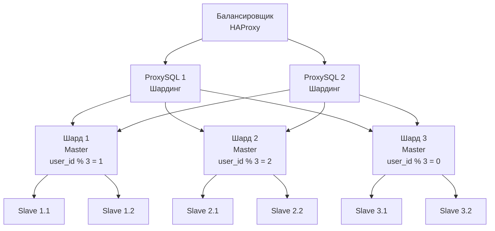

# Домашнее задание к занятию «Репликация и масштабирование. Часть 2»

**Выполнила:** Ксения Волчица

---

## Задание 1

Опишите основные преимущества использования масштабирования методами:

    - активный master-сервер и пассивный репликационный slave-сервер;
    - master-сервер и несколько slave-серверов;
    - активный сервер со специальным механизмом репликации — distributed replicated block device (DRBD);
    - SAN-кластер.

Дайте ответ в свободной форме.

1. Активный master-сервер и пассивный репликационный slave-сервер

Преимущества:

   -  Простота реализации — базовая конфигурация, легко настраивается
   -  Резервирование — при падении master можно переключиться на slave (ручной failover)
   -  Разгрузка master — все запросы на чтение идут на slave, master обрабатывает только запись
   -  Бэкапирование — можно создавать бэкапы на slave без остановки master
   -  Тестирование — slave можно использовать для проверки новых версий или запросов

2. Master-сервер и несколько slave-серверов

Преимущества:

   - Горизонтальное масштабирование чтения — нагрузка распределяется между несколькими slave
   - Высокая доступность — если один slave падает, другие продолжают работать
   - Специализация slave — разные slave для разных типов запросов (отчёты, аналитика, поиск)
   - Географическое распределение — slave в разных регионах для снижения задержек
   - Отказоустойчивость — можно быстро переключить master на любой slave

3. Активный сервер с механизмом DRBD (Distributed Replicated Block Device)

Преимущества:

   - Синхронизация на уровне блоков — полная идентичность данных на обоих серверах
   - Быстрый failover — переключение занимает секунды
   - Высокая надёжность — данные всегда синхронизированы
   - Прозрачность для приложений — приложения не знают о репликации
   - Поддержка любых файловых систем — работает на уровне блочных устройств

4. SAN-кластер (Storage Area Network)

Преимущества:

   - Единое хранилище — все серверы видят одни и те же данные
   - Простота управления — управление хранилищем из одного центра
   - Консистентность данных — нет рассинхронизации между серверами
   - Высокая производительность — специализированное оборудование
   - Гибкость — можно добавлять новые серверы без переноса данных

---

## Задание 2

Разработайте план для выполнения горизонтального и вертикального шаринга базы данных. База данных состоит из трёх таблиц:

    - пользователи,
    - книги,
    - магазины (столбцы произвольно).

Опишите принципы построения системы и их разграничение или разбивку между базами данных.

Пришлите блоксхему, где и что будет располагаться. Опишите, в каких режимах будут работать сервера.

## Исходные таблицы

| Таблица | Столбцы | Описание |
|---------|---------|----------|
| **users** | `user_id`, `username`, `email`, `password_hash`, `first_name`, `last_name`, `created_at`, `is_active` | Информация о пользователях |
| **books** | `book_id`, `title`, `author`, `isbn`, `publication_year`, `genre`, `price`, `stock_quantity` | Каталог книг |
| **stores** | `store_id`, `name`, `address`, `city`, `phone`, `email`, `created_at` | Информация о магазинах |

### Вертикальный шардинг

Разделение по функциональному признаку:

Таблицы разделены по функциональному признаку с учётом типа нагрузки:

| Сервис | Таблицы | Назначение | Тип нагрузки |
|--------|---------|------------|--------------|
| **Сервис пользователей** | `users`, `user_profiles`, `user_sessions` | Аутентификация, профили | OLTP (много запросов) |
| **Сервис книг** | `books`, `book_categories`, `authors` | Каталог книг | OLTP + OLAP (поиск) |
| **Сервис магазинов** | `stores`, `store_inventory`, `orders` | Склад, продажи | OLTP (транзакции) |

### Горизонтальный шардинг
 

Данные распределены по ключу `user_id` с использованием хеширования по модулю 3:

| Шард | Ключ | Таблицы | Количество пользователей |
|------|------|---------|--------------------------|
| **Шард 1** | `user_id % 3 = 1` | Все таблицы | ~33% |
| **Шард 2** | `user_id % 3 = 2` | Все таблицы | ~33% |
| **Шард 3** | `user_id % 3 = 0` | Все таблицы | ~33% |

**Схема шардинга с балансировкой**

### Режимы работы серверов

#### Уровень хранения данных

| Компонент | Режим | Назначение |
|-----------|-------|------------|
| **Master (каждый шард)** | `READ/WRITE` | Приём изменений, запись данных |
| **Slave (каждый шард)** | `READ ONLY` | Чтение, отчёты, аналитика |

#### Уровень маршрутизации и балансировки

| Компонент | Режим | Назначение |
|-----------|-------|------------|
| **ProxySQL** | Маршрутизация | Распределение запросов по шардам |
| **HAProxy** | Балансировка | Распределение нагрузки между ProxySQL |

---

## Задание 3*

Выполните настройку выбранных методов шардинга из задания 2.

Пришлите конфиг Docker и SQL скрипт с командами для базы данных.

Конфигурационные файлы

   - [Docker Compose для развёртывания шардов и ProxySQL:](docker-compose-shard.yml)

   - [SQL скрипт для создания таблиц и функций шардинга:](sharding_setup.sql)

   - [ Конфигурация ProxySQL (правила маршрутизации и серверы):](proxysql.cnf)

Краткое описание содержимого файлов:

   - docker-compose-shard.yml — описывает запуск 3 мастер-контейнеров (по одному на шард), 3 слейв-контейнеров (для чтения) и одного ProxySQL для маршрутизации запросов.

   - sharding_setup.sql — создаёт таблицы users, books, stores в каждом шарде, а также функцию get_shard_id() для определения номера шарда по user_id.

   - proxysql.cnf — настраивает группы серверов (мастер-группы для записи, слейв-группы для чтения) и правила маршрутизации на основе шаблонов запросов (например, SELECT ... WHERE user_id = ? направляется в соответствующий шард).
