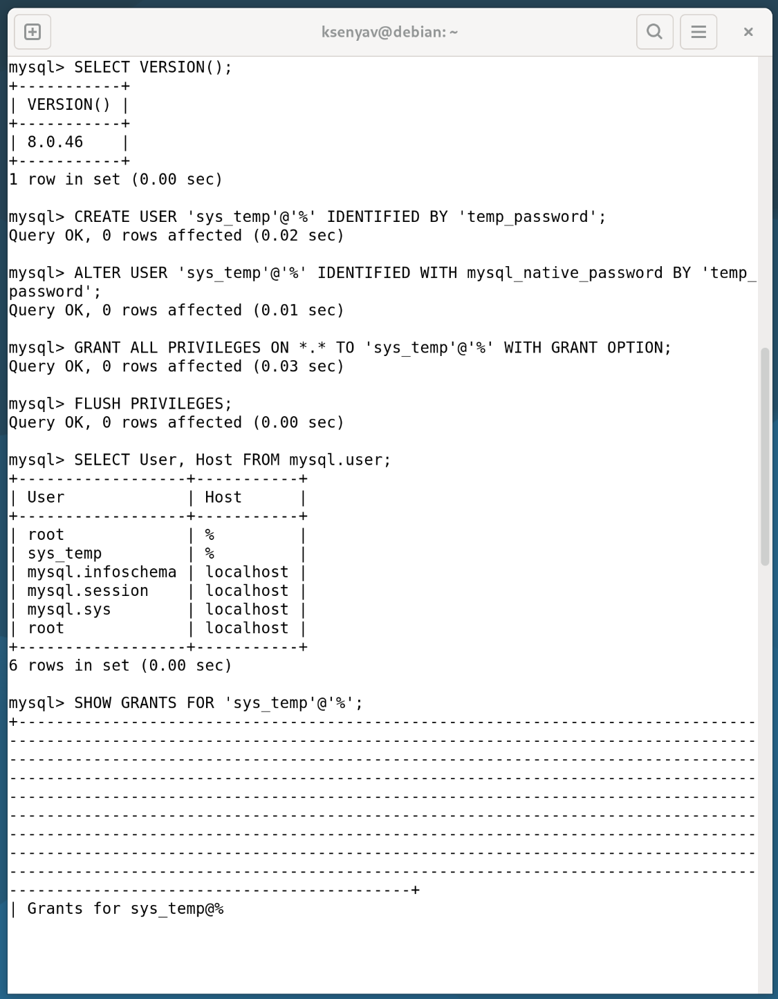
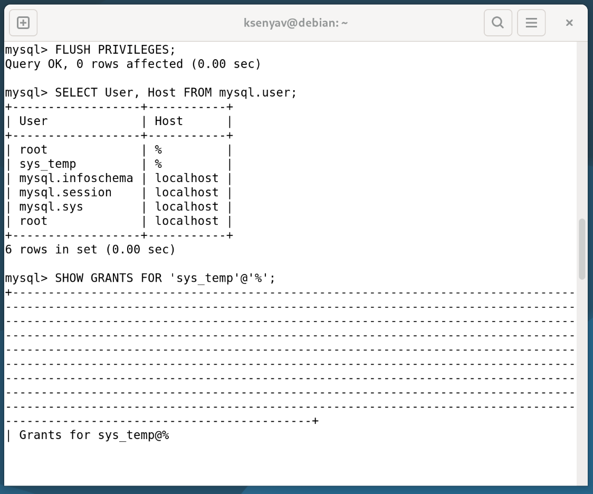
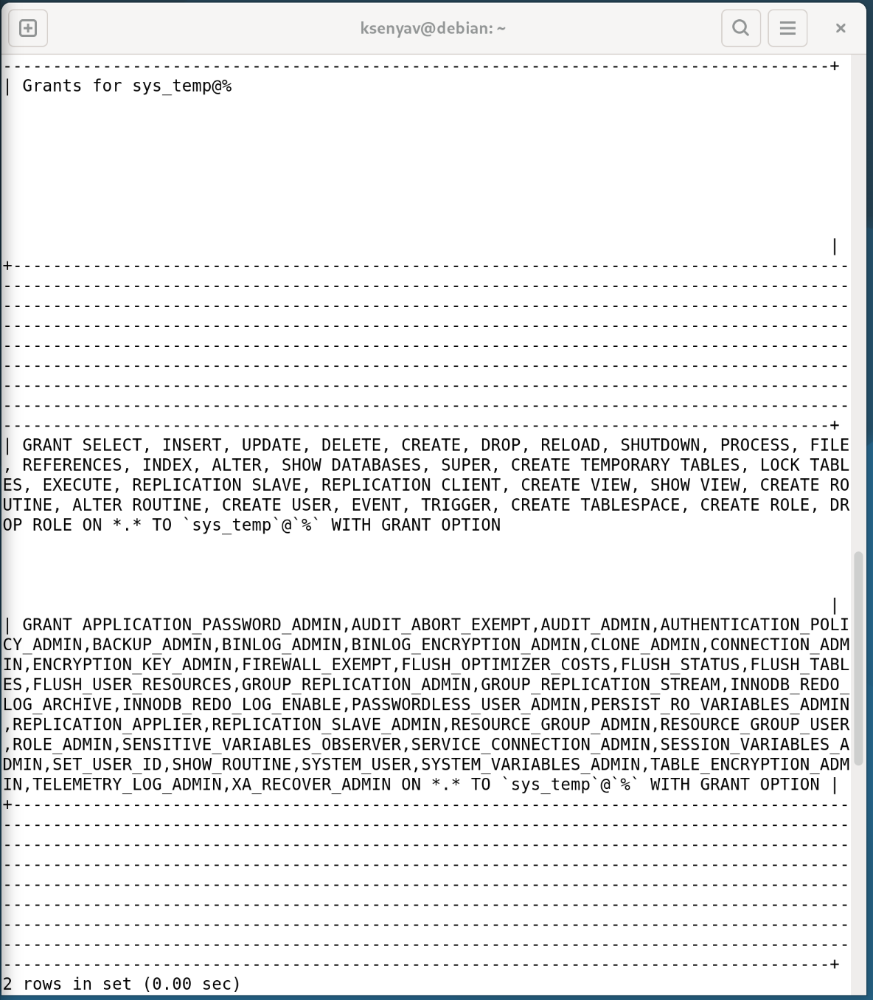

# Домашнее задание к занятию «Базы данных»

**Выполнила:** Ксения Волчица

---

## Задание 1

### 1.1. Поднимите чистый инстанс MySQL версии 8.0+

Для выполнения задания использован Docker-контейнер с MySQL 8.0:

```bash
# Запуск контейнера MySQL 8.0
docker run -d \
  --name mysql-hw \
  -e MYSQL_ROOT_PASSWORD=root_password \
  -e MYSQL_DATABASE=sakila \
  -p 3306:3306 \
  mysql:8.0
# Проверка работы контейнера:
docker ps
docker logs mysql-hw
```

#### 1.2. Скриншот создания пользователя:



```bash
# Подключаемся к MySQL
docker exec -it mysql-hw mysql -u root -proot_password
```
```sql
-- Создание пользователя sys_temp
CREATE USER 'sys_temp'@'%' IDENTIFIED BY 'temp_password';

-- Смена типа аутентификации для совместимости с клиентами
ALTER USER 'sys_temp'@'%' IDENTIFIED WITH mysql_native_password BY 'temp_password';

-- Проверка создания пользователя
SELECT User, Host FROM mysql.user WHERE User = 'sys_temp';
```
### 1.3. Запрос на получение списка пользователей в базе данных:



```sql
-- Получение списка всех пользователей
SELECT User, Host FROM mysql.user;
```
### 1.4.-1.5. Дайте все права для пользователя sys_temp



### 1.6. Переподключитесь к базе данных от имени sys_temp

Для смены типа аутентификации с caching_sha2_password на mysql_native_password (для совместимости с клиентами):

```sql
ALTER USER 'sys_temp'@'%' IDENTIFIED WITH mysql_native_password BY 'temp_password';
FLUSH PRIVILEGES;
```
Подключение от имени sys_temp:

```bash
# Подключение через Docker
docker exec -it mysql-hw mysql -u sys_temp -ptemp_password

# Или через localhost (если установлен mysql-client)
mysql -u sys_temp -ptemp_password -h 127.0.0.1 -P 3306
```

Проверка подключения:

```sql
-- Проверка пользователя
SELECT USER(), CURRENT_USER();

-- Проверка доступных баз
SHOW DATABASES;
```

### 1.7. Восстановите дамп в базу данных

Скачивание дампа Sakila:

```bash
# Скачиваем архив с дампом
wget https://downloads.mysql.com/docs/sakila-db.zip

# Распаковываем
unzip sakila-db.zip

# Проверяем содержимое
ls -la sakila-db/
# Должны быть файлы: sakila-schema.sql и sakila-data.sql
# Восстанавливаем структуру базы данных
docker exec -i mysql-hw mysql -u root -proot_password sakila < sakila-db/sakila-schema.sql

# Восстанавливаем данные
docker exec -i mysql-hw mysql -u root -proot_password sakila < sakila-db/sakila-data.sql

```

Проверка восстановления:
```bash
-- Подключаемся к MySQL
docker exec -it mysql-hw mysql -u root -proot_password

-- Проверяем базы данных
SHOW DATABASES;

-- Переключаемся на sakila
USE sakila;

-- Проверяем таблицы
SHOW TABLES;

-- Проверяем количество записей
SELECT COUNT(*) FROM actor;      -- должно быть 200
SELECT COUNT(*) FROM film;       -- должно быть 1000
SELECT COUNT(*) FROM customer;   -- должно быть 599
SELECT COUNT(*) FROM film_actor; -- должно быть 5462
```

Ожидаемые результаты:
```text
+----------------------------+
| Tables_in_sakila           |
+----------------------------+
| actor                      |
| address                    |
| category                   |
| city                       |
| country                    |
| customer                   |
| film                       |
| film_actor                 |
| film_category              |
| film_text                  |
| inventory                  |
| language                   |
| payment                    |
| rental                     |
| staff                      |
| store                      |
+----------------------------+

+----------+-------+
| COUNT(*) |       |
+----------+-------+
|      200 | actor |
|     1000 | film  |
|      599 | customer |
|     5462 | film_actor |
+----------+-------+
```
### 1.8. Получите ER-диаграмму базы данных

ER-диаграмма базы данных Sakila, созданная в DBeaver:


# Задание 2

Таблица первичных ключей таблиц базы Sakila

| Таблица | Первичный ключ |
|---------|----------------|
| actor | actor_id |
| address | address_id |
| category | category_id |
| city | city_id |
| country | country_id |
| customer | customer_id |
| film | film_id |
| film_actor | (actor_id, film_id) |
| film_category | (film_id, category_id) |
| film_text | film_id |
| inventory | inventory_id |
| language | language_id |
| payment | payment_id |
| rental | rental_id |
| staff | staff_id |
| store | store_id |

# Задание 3*

### 3.1. Уберите права на INSERT, UPDATE, DELETE

```sql
REVOKE INSERT, UPDATE, DELETE ON *.* FROM 'sys_temp'@'%';
GRANT SELECT ON sakila.* TO 'sys_temp'@'%';
FLUSH PRIVILEGES;
```


